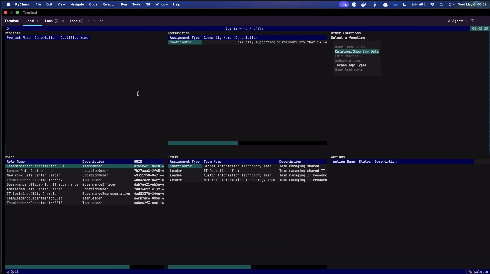
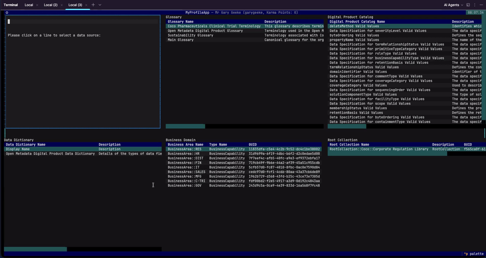

---
hide:
- toc
---

<!-- SPDX-License-Identifier: CC-BY-4.0 -->
<!-- Copyright Contributors to the Egeria project. -->

# My Egeria

--8<-- "snippets/work-in-progress.md"

My Egeria is a interface to help you build a personalized view into open metadata.  You can set up your profile, share your views and collaborate with others.  It is possible to build favourite collections and subscribe to digital products.

My Egeria runs on the command line, or in a web browser.

> This is the home page for My Egeria.

> This is the view of different catalogs in open metadata

--8<-- "snippets/abbr.md"