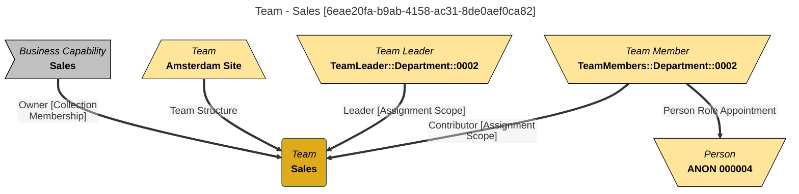

```mermaid
---
title: Team - Sales [6eae20fa-b9ab-4158-ac31-8de0aef0ca82]
---
flowchart TD
%%{init: {"flowchart": {"htmlLabels": false}} }%%

1@{ shape: rounded, label: "*Team*
**Sales**"}
2@{ shape: odd, label: "*Business Capability*
**Sales**"}
2==>|"Owner [Collection Membership]"|1
3@{ shape: trap-b, label: "*Team*
**Amsterdam Site**"}
3==>|"Team Structure"|1
4@{ shape: trap-t, label: "*Team Leader*
**TeamLeader::Department::0002**"}
4==>|"Leader [Assignment Scope]"|1
5@{ shape: trap-t, label: "*Team Member*
**TeamMembers::Department::0002**"}
5==>|"Contributor [Assignment Scope]"|1
6@{ shape: trap-t, label: "*Person*
**ANON 000004**"}
5==>|"Person Role Appointment"|6
style 1 color:#000000, fill:#e0ab18, stroke:#004563
style 2 color:#000000, fill:#C0C0C0, stroke:#000000
style 3 color:#000000, fill:#FFE599, stroke:#000000
style 4 color:#000000, fill:#FFE599, stroke:#000000
style 5 color:#000000, fill:#FFE599, stroke:#000000
style 6 color:#000000, fill:#FFE599, stroke:#000000
```
