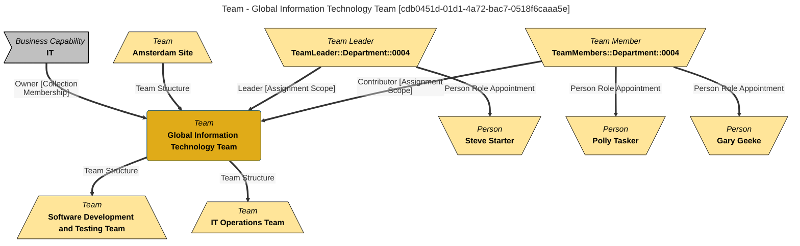

```mermaid
---
title: Team - Global Information Technology Team [cdb0451d-01d1-4a72-bac7-0518f6caaa5e]
---
flowchart TD
%%{init: {"flowchart": {"htmlLabels": false}} }%%

1@{ shape: rounded, label: "*Team*
**Global Information Technology Team**"}
2@{ shape: odd, label: "*Business Capability*
**IT**"}
2==>|"Owner [Collection Membership]"|1
3@{ shape: trap-b, label: "*Team*
**Amsterdam Site**"}
3==>|"Team Structure"|1
4@{ shape: trap-b, label: "*Team*
**Software Development and Testing Team**"}
1==>|"Team Structure"|4
5@{ shape: trap-b, label: "*Team*
**IT Operations Team**"}
1==>|"Team Structure"|5
6@{ shape: trap-t, label: "*Team Leader*
**TeamLeader::Department::0004**"}
6==>|"Leader [Assignment Scope]"|1
7@{ shape: trap-t, label: "*Person*
**Steve Starter**"}
6==>|"Person Role Appointment"|7
8@{ shape: trap-t, label: "*Team Member*
**TeamMembers::Department::0004**"}
8==>|"Contributor [Assignment Scope]"|1
9@{ shape: trap-t, label: "*Person*
**Polly Tasker**"}
8==>|"Person Role Appointment"|9
10@{ shape: trap-t, label: "*Person*
**Gary Geeke**"}
8==>|"Person Role Appointment"|10
style 1 color:#000000, fill:#e0ab18, stroke:#004563
style 2 color:#000000, fill:#C0C0C0, stroke:#000000
style 3 color:#000000, fill:#FFE599, stroke:#000000
style 4 color:#000000, fill:#FFE599, stroke:#000000
style 5 color:#000000, fill:#FFE599, stroke:#000000
style 6 color:#000000, fill:#FFE599, stroke:#000000
style 7 color:#000000, fill:#FFE599, stroke:#000000
style 8 color:#000000, fill:#FFE599, stroke:#000000
style 9 color:#000000, fill:#FFE599, stroke:#000000
style 10 color:#000000, fill:#FFE599, stroke:#000000
```
