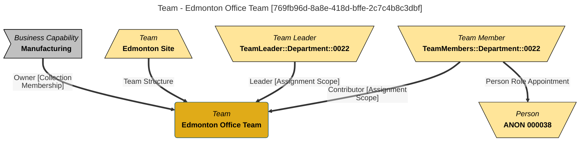

```mermaid
---
title: Team - Edmonton Office Team [769fb96d-8a8e-418d-bffe-2c7c4b8c3dbf]
---
flowchart TD
%%{init: {"flowchart": {"htmlLabels": false}} }%%

1@{ shape: rounded, label: "*Team*
**Edmonton Office Team**"}
2@{ shape: odd, label: "*Business Capability*
**Manufacturing**"}
2==>|"Owner [Collection Membership]"|1
3@{ shape: trap-b, label: "*Team*
**Edmonton Site**"}
3==>|"Team Structure"|1
4@{ shape: trap-t, label: "*Team Leader*
**TeamLeader::Department::0022**"}
4==>|"Leader [Assignment Scope]"|1
5@{ shape: trap-t, label: "*Team Member*
**TeamMembers::Department::0022**"}
5==>|"Contributor [Assignment Scope]"|1
6@{ shape: trap-t, label: "*Person*
**ANON 000038**"}
5==>|"Person Role Appointment"|6
style 1 color:#000000, fill:#e0ab18, stroke:#004563
style 2 color:#000000, fill:#C0C0C0, stroke:#000000
style 3 color:#000000, fill:#FFE599, stroke:#000000
style 4 color:#000000, fill:#FFE599, stroke:#000000
style 5 color:#000000, fill:#FFE599, stroke:#000000
style 6 color:#000000, fill:#FFE599, stroke:#000000
```
