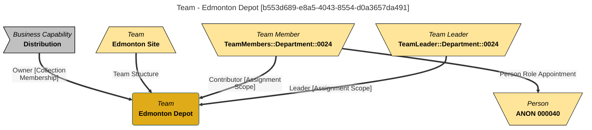

```mermaid
---
title: Team - Edmonton Depot [b553d689-e8a5-4043-8554-d0a3657da491]
---
flowchart TD
%%{init: {"flowchart": {"htmlLabels": false}} }%%

1@{ shape: rounded, label: "*Team*
**Edmonton Depot**"}
2@{ shape: odd, label: "*Business Capability*
**Distribution**"}
2==>|"Owner [Collection Membership]"|1
3@{ shape: trap-b, label: "*Team*
**Edmonton Site**"}
3==>|"Team Structure"|1
4@{ shape: trap-t, label: "*Team Member*
**TeamMembers::Department::0024**"}
4==>|"Contributor [Assignment Scope]"|1
5@{ shape: trap-t, label: "*Person*
**ANON 000040**"}
4==>|"Person Role Appointment"|5
6@{ shape: trap-t, label: "*Team Leader*
**TeamLeader::Department::0024**"}
6==>|"Leader [Assignment Scope]"|1
style 1 color:#000000, fill:#e0ab18, stroke:#004563
style 2 color:#000000, fill:#C0C0C0, stroke:#000000
style 3 color:#000000, fill:#FFE599, stroke:#000000
style 4 color:#000000, fill:#FFE599, stroke:#000000
style 5 color:#000000, fill:#FFE599, stroke:#000000
style 6 color:#000000, fill:#FFE599, stroke:#000000
```
