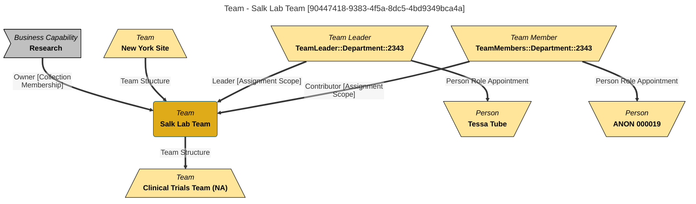

```mermaid
---
title: Team - Salk Lab Team [90447418-9383-4f5a-8dc5-4bd9349bca4a]
---
flowchart TD
%%{init: {"flowchart": {"htmlLabels": false}} }%%

1@{ shape: rounded, label: "*Team*
**Salk Lab Team**"}
2@{ shape: odd, label: "*Business Capability*
**Research**"}
2==>|"Owner [Collection Membership]"|1
3@{ shape: trap-b, label: "*Team*
**New York Site**"}
3==>|"Team Structure"|1
4@{ shape: trap-b, label: "*Team*
**Clinical Trials Team (NA)**"}
1==>|"Team Structure"|4
5@{ shape: trap-t, label: "*Team Leader*
**TeamLeader::Department::2343**"}
5==>|"Leader [Assignment Scope]"|1
6@{ shape: trap-t, label: "*Person*
**Tessa Tube**"}
5==>|"Person Role Appointment"|6
7@{ shape: trap-t, label: "*Team Member*
**TeamMembers::Department::2343**"}
7==>|"Contributor [Assignment Scope]"|1
8@{ shape: trap-t, label: "*Person*
**ANON 000019**"}
7==>|"Person Role Appointment"|8
style 1 color:#000000, fill:#e0ab18, stroke:#004563
style 2 color:#000000, fill:#C0C0C0, stroke:#000000
style 3 color:#000000, fill:#FFE599, stroke:#000000
style 4 color:#000000, fill:#FFE599, stroke:#000000
style 5 color:#000000, fill:#FFE599, stroke:#000000
style 6 color:#000000, fill:#FFE599, stroke:#000000
style 7 color:#000000, fill:#FFE599, stroke:#000000
style 8 color:#000000, fill:#FFE599, stroke:#000000
```
