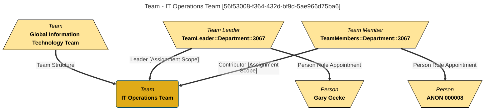

```mermaid
---
title: Team - IT Operations Team [56f53008-f364-432d-bf9d-5ae966d75ba6]
---
flowchart TD
%%{init: {"flowchart": {"htmlLabels": false}} }%%

1@{ shape: rounded, label: "*Team*
**IT Operations Team**"}
2@{ shape: trap-b, label: "*Team*
**Global Information Technology Team**"}
2==>|"Team Structure"|1
3@{ shape: trap-t, label: "*Team Leader*
**TeamLeader::Department::3067**"}
3==>|"Leader [Assignment Scope]"|1
4@{ shape: trap-t, label: "*Person*
**Gary Geeke**"}
3==>|"Person Role Appointment"|4
5@{ shape: trap-t, label: "*Team Member*
**TeamMembers::Department::3067**"}
5==>|"Contributor [Assignment Scope]"|1
6@{ shape: trap-t, label: "*Person*
**ANON 000008**"}
5==>|"Person Role Appointment"|6
style 1 color:#000000, fill:#e0ab18, stroke:#004563
style 2 color:#000000, fill:#FFE599, stroke:#000000
style 3 color:#000000, fill:#FFE599, stroke:#000000
style 4 color:#000000, fill:#FFE599, stroke:#000000
style 5 color:#000000, fill:#FFE599, stroke:#000000
style 6 color:#000000, fill:#FFE599, stroke:#000000
```
