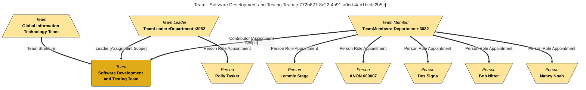

```mermaid
---
title: Team - Software Development and Testing Team [e772b627-8c22-4b91-a0cd-4ab1bcdc2b5c]
---
flowchart TD
%%{init: {"flowchart": {"htmlLabels": false}} }%%

1@{ shape: rounded, label: "*Team*
**Software Development and Testing Team**"}
2@{ shape: trap-b, label: "*Team*
**Global Information Technology Team**"}
2==>|"Team Structure"|1
3@{ shape: trap-t, label: "*Team Leader*
**TeamLeader::Department::3082**"}
3==>|"Leader [Assignment Scope]"|1
4@{ shape: trap-t, label: "*Person*
**Polly Tasker**"}
3==>|"Person Role Appointment"|4
5@{ shape: trap-t, label: "*Team Member*
**TeamMembers::Department::3082**"}
5==>|"Contributor [Assignment Scope]"|1
6@{ shape: trap-t, label: "*Person*
**Lemmie Stage**"}
5==>|"Person Role Appointment"|6
7@{ shape: trap-t, label: "*Person*
**ANON 000007**"}
5==>|"Person Role Appointment"|7
8@{ shape: trap-t, label: "*Person*
**Des Signa**"}
5==>|"Person Role Appointment"|8
9@{ shape: trap-t, label: "*Person*
**Bob Nitter**"}
5==>|"Person Role Appointment"|9
10@{ shape: trap-t, label: "*Person*
**Nancy Noah**"}
5==>|"Person Role Appointment"|10
style 1 color:#000000, fill:#e0ab18, stroke:#004563
style 2 color:#000000, fill:#FFE599, stroke:#000000
style 3 color:#000000, fill:#FFE599, stroke:#000000
style 4 color:#000000, fill:#FFE599, stroke:#000000
style 5 color:#000000, fill:#FFE599, stroke:#000000
style 6 color:#000000, fill:#FFE599, stroke:#000000
style 7 color:#000000, fill:#FFE599, stroke:#000000
style 8 color:#000000, fill:#FFE599, stroke:#000000
style 9 color:#000000, fill:#FFE599, stroke:#000000
style 10 color:#000000, fill:#FFE599, stroke:#000000
```
