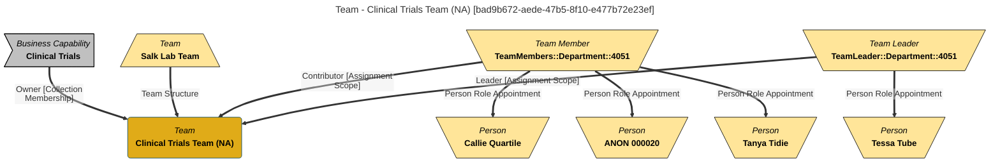

```mermaid
---
title: Team - Clinical Trials Team (NA) [bad9b672-aede-47b5-8f10-e477b72e23ef]
---
flowchart TD
%%{init: {"flowchart": {"htmlLabels": false}} }%%

1@{ shape: rounded, label: "*Team*
**Clinical Trials Team (NA)**"}
2@{ shape: odd, label: "*Business Capability*
**Clinical Trials**"}
2==>|"Owner [Collection Membership]"|1
3@{ shape: trap-b, label: "*Team*
**Salk Lab Team**"}
3==>|"Team Structure"|1
4@{ shape: trap-t, label: "*Team Member*
**TeamMembers::Department::4051**"}
4==>|"Contributor [Assignment Scope]"|1
5@{ shape: trap-t, label: "*Person*
**Callie Quartile**"}
4==>|"Person Role Appointment"|5
6@{ shape: trap-t, label: "*Person*
**ANON 000020**"}
4==>|"Person Role Appointment"|6
7@{ shape: trap-t, label: "*Person*
**Tanya Tidie**"}
4==>|"Person Role Appointment"|7
8@{ shape: trap-t, label: "*Team Leader*
**TeamLeader::Department::4051**"}
8==>|"Leader [Assignment Scope]"|1
9@{ shape: trap-t, label: "*Person*
**Tessa Tube**"}
8==>|"Person Role Appointment"|9
style 1 color:#000000, fill:#e0ab18, stroke:#004563
style 2 color:#000000, fill:#C0C0C0, stroke:#000000
style 3 color:#000000, fill:#FFE599, stroke:#000000
style 4 color:#000000, fill:#FFE599, stroke:#000000
style 5 color:#000000, fill:#FFE599, stroke:#000000
style 6 color:#000000, fill:#FFE599, stroke:#000000
style 7 color:#000000, fill:#FFE599, stroke:#000000
style 8 color:#000000, fill:#FFE599, stroke:#000000
style 9 color:#000000, fill:#FFE599, stroke:#000000
```
