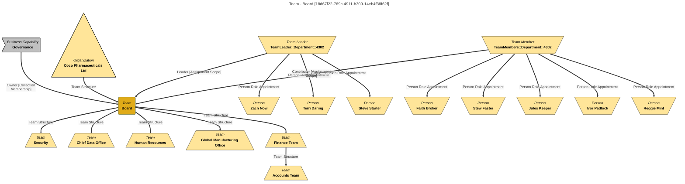

```mermaid
---
title: Team - Board [18d67f22-769c-4911-b309-14eb4f38f62f]
---
flowchart TD
%%{init: {"flowchart": {"htmlLabels": false}} }%%

1@{ shape: rounded, label: "*Team*
**Board**"}
2@{ shape: odd, label: "*Business Capability*
**Governance**"}
2==>|"Owner [Collection Membership]"|1
3@{ shape: tri, label: "*Organization*
**Coco Pharmaceuticals Ltd**"}
3==>|"Team Structure"|1
4@{ shape: trap-b, label: "*Team*
**Security**"}
1==>|"Team Structure"|4
5@{ shape: trap-b, label: "*Team*
**Chief Data Office**"}
1==>|"Team Structure"|5
6@{ shape: trap-b, label: "*Team*
**Human Resources**"}
1==>|"Team Structure"|6
7@{ shape: trap-b, label: "*Team*
**Global Manufacturing Office**"}
1==>|"Team Structure"|7
8@{ shape: trap-b, label: "*Team*
**Finance Team**"}
1==>|"Team Structure"|8
9@{ shape: trap-b, label: "*Team*
**Accounts Team**"}
8==>|"Team Structure"|9
10@{ shape: trap-t, label: "*Team Leader*
**TeamLeader::Department::4302**"}
10==>|"Leader [Assignment Scope]"|1
11@{ shape: trap-t, label: "*Person*
**Zach Now**"}
10==>|"Person Role Appointment"|11
12@{ shape: trap-t, label: "*Person*
**Terri Daring**"}
10==>|"Person Role Appointment"|12
13@{ shape: trap-t, label: "*Person*
**Steve Starter**"}
10==>|"Person Role Appointment"|13
14@{ shape: trap-t, label: "*Team Member*
**TeamMembers::Department::4302**"}
14==>|"Contributor [Assignment Scope]"|1
15@{ shape: trap-t, label: "*Person*
**Faith Broker**"}
14==>|"Person Role Appointment"|15
16@{ shape: trap-t, label: "*Person*
**Stew Faster**"}
14==>|"Person Role Appointment"|16
17@{ shape: trap-t, label: "*Person*
**Jules Keeper**"}
14==>|"Person Role Appointment"|17
18@{ shape: trap-t, label: "*Person*
**Ivor Padlock**"}
14==>|"Person Role Appointment"|18
19@{ shape: trap-t, label: "*Person*
**Reggie Mint**"}
14==>|"Person Role Appointment"|19
style 11 color:#000000, fill:#FFE599, stroke:#000000
style 12 color:#000000, fill:#FFE599, stroke:#000000
style 13 color:#000000, fill:#FFE599, stroke:#000000
style 14 color:#000000, fill:#FFE599, stroke:#000000
style 15 color:#000000, fill:#FFE599, stroke:#000000
style 16 color:#000000, fill:#FFE599, stroke:#000000
style 17 color:#000000, fill:#FFE599, stroke:#000000
style 18 color:#000000, fill:#FFE599, stroke:#000000
style 19 color:#000000, fill:#FFE599, stroke:#000000
style 1 color:#000000, fill:#e0ab18, stroke:#004563
style 2 color:#000000, fill:#C0C0C0, stroke:#000000
style 3 color:#000000, fill:#FFE599, stroke:#000000
style 4 color:#000000, fill:#FFE599, stroke:#000000
style 5 color:#000000, fill:#FFE599, stroke:#000000
style 6 color:#000000, fill:#FFE599, stroke:#000000
style 7 color:#000000, fill:#FFE599, stroke:#000000
style 8 color:#000000, fill:#FFE599, stroke:#000000
style 9 color:#000000, fill:#FFE599, stroke:#000000
style 10 color:#000000, fill:#FFE599, stroke:#000000
```
