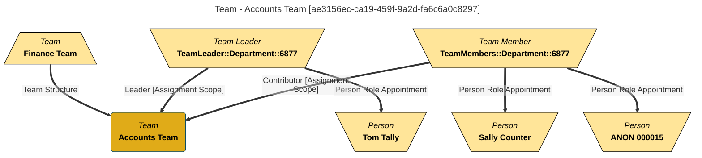

```mermaid
---
title: Team - Accounts Team [ae3156ec-ca19-459f-9a2d-fa6c6a0c8297]
---
flowchart TD
%%{init: {"flowchart": {"htmlLabels": false}} }%%

1@{ shape: rounded, label: "*Team*
**Accounts Team**"}
2@{ shape: trap-b, label: "*Team*
**Finance Team**"}
2==>|"Team Structure"|1
3@{ shape: trap-t, label: "*Team Leader*
**TeamLeader::Department::6877**"}
3==>|"Leader [Assignment Scope]"|1
4@{ shape: trap-t, label: "*Person*
**Tom Tally**"}
3==>|"Person Role Appointment"|4
5@{ shape: trap-t, label: "*Team Member*
**TeamMembers::Department::6877**"}
5==>|"Contributor [Assignment Scope]"|1
6@{ shape: trap-t, label: "*Person*
**Sally Counter**"}
5==>|"Person Role Appointment"|6
7@{ shape: trap-t, label: "*Person*
**ANON 000015**"}
5==>|"Person Role Appointment"|7
style 1 color:#000000, fill:#e0ab18, stroke:#004563
style 2 color:#000000, fill:#FFE599, stroke:#000000
style 3 color:#000000, fill:#FFE599, stroke:#000000
style 4 color:#000000, fill:#FFE599, stroke:#000000
style 5 color:#000000, fill:#FFE599, stroke:#000000
style 6 color:#000000, fill:#FFE599, stroke:#000000
style 7 color:#000000, fill:#FFE599, stroke:#000000
```
