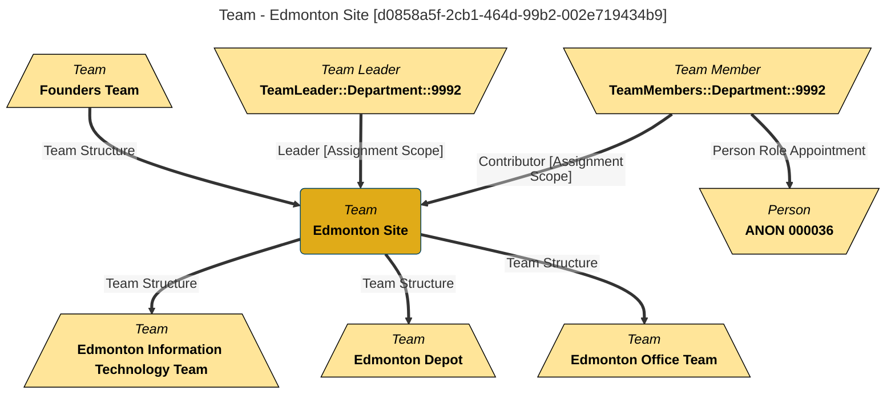

```mermaid
---
title: Team - Edmonton Site [d0858a5f-2cb1-464d-99b2-002e719434b9]
---
flowchart TD
%%{init: {"flowchart": {"htmlLabels": false}} }%%

1@{ shape: rounded, label: "*Team*
**Edmonton Site**"}
2@{ shape: trap-b, label: "*Team*
**Founders Team**"}
2==>|"Team Structure"|1
3@{ shape: trap-b, label: "*Team*
**Edmonton Information Technology Team**"}
1==>|"Team Structure"|3
4@{ shape: trap-b, label: "*Team*
**Edmonton Depot**"}
1==>|"Team Structure"|4
5@{ shape: trap-b, label: "*Team*
**Edmonton Office Team**"}
1==>|"Team Structure"|5
6@{ shape: trap-t, label: "*Team Leader*
**TeamLeader::Department::9992**"}
6==>|"Leader [Assignment Scope]"|1
7@{ shape: trap-t, label: "*Team Member*
**TeamMembers::Department::9992**"}
7==>|"Contributor [Assignment Scope]"|1
8@{ shape: trap-t, label: "*Person*
**ANON 000036**"}
7==>|"Person Role Appointment"|8
style 1 color:#000000, fill:#e0ab18, stroke:#004563
style 2 color:#000000, fill:#FFE599, stroke:#000000
style 3 color:#000000, fill:#FFE599, stroke:#000000
style 4 color:#000000, fill:#FFE599, stroke:#000000
style 5 color:#000000, fill:#FFE599, stroke:#000000
style 6 color:#000000, fill:#FFE599, stroke:#000000
style 7 color:#000000, fill:#FFE599, stroke:#000000
style 8 color:#000000, fill:#FFE599, stroke:#000000
```
