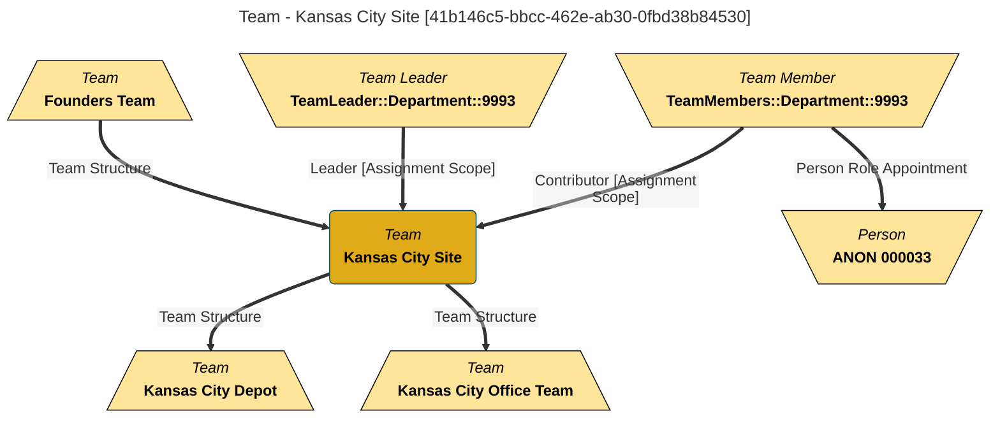

```mermaid
---
title: Team - Kansas City Site [41b146c5-bbcc-462e-ab30-0fbd38b84530]
---
flowchart TD
%%{init: {"flowchart": {"htmlLabels": false}} }%%

1@{ shape: rounded, label: "*Team*
**Kansas City Site**"}
2@{ shape: trap-b, label: "*Team*
**Founders Team**"}
2==>|"Team Structure"|1
3@{ shape: trap-b, label: "*Team*
**Kansas City Depot**"}
1==>|"Team Structure"|3
4@{ shape: trap-b, label: "*Team*
**Kansas City Office Team**"}
1==>|"Team Structure"|4
5@{ shape: trap-t, label: "*Team Leader*
**TeamLeader::Department::9993**"}
5==>|"Leader [Assignment Scope]"|1
6@{ shape: trap-t, label: "*Team Member*
**TeamMembers::Department::9993**"}
6==>|"Contributor [Assignment Scope]"|1
7@{ shape: trap-t, label: "*Person*
**ANON 000033**"}
6==>|"Person Role Appointment"|7
style 1 color:#000000, fill:#e0ab18, stroke:#004563
style 2 color:#000000, fill:#FFE599, stroke:#000000
style 3 color:#000000, fill:#FFE599, stroke:#000000
style 4 color:#000000, fill:#FFE599, stroke:#000000
style 5 color:#000000, fill:#FFE599, stroke:#000000
style 6 color:#000000, fill:#FFE599, stroke:#000000
style 7 color:#000000, fill:#FFE599, stroke:#000000
```
