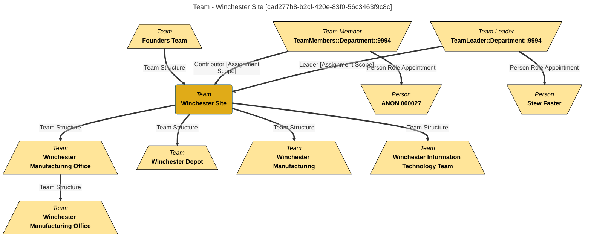

```mermaid
---
title: Team - Winchester Site [cad277b8-b2cf-420e-83f0-56c3463f9c8c]
---
flowchart TD
%%{init: {"flowchart": {"htmlLabels": false}} }%%

1@{ shape: rounded, label: "*Team*
**Winchester Site**"}
2@{ shape: trap-b, label: "*Team*
**Founders Team**"}
2==>|"Team Structure"|1
3@{ shape: trap-b, label: "*Team*
**Winchester Manufacturing Office**"}
1==>|"Team Structure"|3
4@{ shape: trap-b, label: "*Team*
**Winchester Manufacturing Office**"}
3==>|"Team Structure"|4
5@{ shape: trap-b, label: "*Team*
**Winchester Depot**"}
1==>|"Team Structure"|5
6@{ shape: trap-b, label: "*Team*
**Winchester Manufacturing**"}
1==>|"Team Structure"|6
7@{ shape: trap-b, label: "*Team*
**Winchester Information Technology Team**"}
1==>|"Team Structure"|7
8@{ shape: trap-t, label: "*Team Member*
**TeamMembers::Department::9994**"}
8==>|"Contributor [Assignment Scope]"|1
9@{ shape: trap-t, label: "*Person*
**ANON 000027**"}
8==>|"Person Role Appointment"|9
10@{ shape: trap-t, label: "*Team Leader*
**TeamLeader::Department::9994**"}
10==>|"Leader [Assignment Scope]"|1
11@{ shape: trap-t, label: "*Person*
**Stew Faster**"}
10==>|"Person Role Appointment"|11
style 11 color:#000000, fill:#FFE599, stroke:#000000
style 1 color:#000000, fill:#e0ab18, stroke:#004563
style 2 color:#000000, fill:#FFE599, stroke:#000000
style 3 color:#000000, fill:#FFE599, stroke:#000000
style 4 color:#000000, fill:#FFE599, stroke:#000000
style 5 color:#000000, fill:#FFE599, stroke:#000000
style 6 color:#000000, fill:#FFE599, stroke:#000000
style 7 color:#000000, fill:#FFE599, stroke:#000000
style 8 color:#000000, fill:#FFE599, stroke:#000000
style 9 color:#000000, fill:#FFE599, stroke:#000000
style 10 color:#000000, fill:#FFE599, stroke:#000000
```
