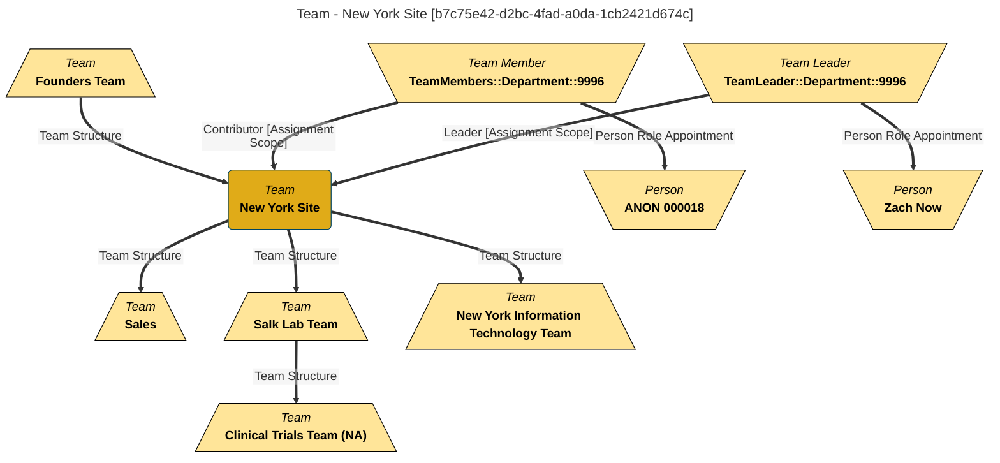

```mermaid
---
title: Team - New York Site [b7c75e42-d2bc-4fad-a0da-1cb2421d674c]
---
flowchart TD
%%{init: {"flowchart": {"htmlLabels": false}} }%%

1@{ shape: rounded, label: "*Team*
**New York Site**"}
2@{ shape: trap-b, label: "*Team*
**Founders Team**"}
2==>|"Team Structure"|1
3@{ shape: trap-b, label: "*Team*
**Sales**"}
1==>|"Team Structure"|3
4@{ shape: trap-b, label: "*Team*
**Salk Lab Team**"}
1==>|"Team Structure"|4
5@{ shape: trap-b, label: "*Team*
**Clinical Trials Team (NA)**"}
4==>|"Team Structure"|5
6@{ shape: trap-b, label: "*Team*
**New York Information Technology Team**"}
1==>|"Team Structure"|6
7@{ shape: trap-t, label: "*Team Member*
**TeamMembers::Department::9996**"}
7==>|"Contributor [Assignment Scope]"|1
8@{ shape: trap-t, label: "*Person*
**ANON 000018**"}
7==>|"Person Role Appointment"|8
9@{ shape: trap-t, label: "*Team Leader*
**TeamLeader::Department::9996**"}
9==>|"Leader [Assignment Scope]"|1
10@{ shape: trap-t, label: "*Person*
**Zach Now**"}
9==>|"Person Role Appointment"|10
style 1 color:#000000, fill:#e0ab18, stroke:#004563
style 2 color:#000000, fill:#FFE599, stroke:#000000
style 3 color:#000000, fill:#FFE599, stroke:#000000
style 4 color:#000000, fill:#FFE599, stroke:#000000
style 5 color:#000000, fill:#FFE599, stroke:#000000
style 6 color:#000000, fill:#FFE599, stroke:#000000
style 7 color:#000000, fill:#FFE599, stroke:#000000
style 8 color:#000000, fill:#FFE599, stroke:#000000
style 9 color:#000000, fill:#FFE599, stroke:#000000
style 10 color:#000000, fill:#FFE599, stroke:#000000
```
