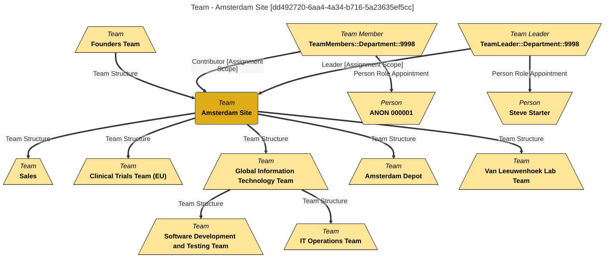

```mermaid
---
title: Team - Amsterdam Site [dd492720-6aa4-4a34-b716-5a23635ef5cc]
---
flowchart TD
%%{init: {"flowchart": {"htmlLabels": false}} }%%

1@{ shape: rounded, label: "*Team*
**Amsterdam Site**"}
2@{ shape: trap-b, label: "*Team*
**Founders Team**"}
2==>|"Team Structure"|1
3@{ shape: trap-b, label: "*Team*
**Sales**"}
1==>|"Team Structure"|3
4@{ shape: trap-b, label: "*Team*
**Clinical Trials Team (EU)**"}
1==>|"Team Structure"|4
5@{ shape: trap-b, label: "*Team*
**Global Information Technology Team**"}
1==>|"Team Structure"|5
6@{ shape: trap-b, label: "*Team*
**Software Development and Testing Team**"}
5==>|"Team Structure"|6
7@{ shape: trap-b, label: "*Team*
**IT Operations Team**"}
5==>|"Team Structure"|7
8@{ shape: trap-b, label: "*Team*
**Amsterdam Depot**"}
1==>|"Team Structure"|8
9@{ shape: trap-b, label: "*Team*
**Van Leeuwenhoek Lab Team**"}
1==>|"Team Structure"|9
10@{ shape: trap-t, label: "*Team Member*
**TeamMembers::Department::9998**"}
10==>|"Contributor [Assignment Scope]"|1
11@{ shape: trap-t, label: "*Person*
**ANON 000001**"}
10==>|"Person Role Appointment"|11
12@{ shape: trap-t, label: "*Team Leader*
**TeamLeader::Department::9998**"}
12==>|"Leader [Assignment Scope]"|1
13@{ shape: trap-t, label: "*Person*
**Steve Starter**"}
12==>|"Person Role Appointment"|13
style 11 color:#000000, fill:#FFE599, stroke:#000000
style 12 color:#000000, fill:#FFE599, stroke:#000000
style 13 color:#000000, fill:#FFE599, stroke:#000000
style 1 color:#000000, fill:#e0ab18, stroke:#004563
style 2 color:#000000, fill:#FFE599, stroke:#000000
style 3 color:#000000, fill:#FFE599, stroke:#000000
style 4 color:#000000, fill:#FFE599, stroke:#000000
style 5 color:#000000, fill:#FFE599, stroke:#000000
style 6 color:#000000, fill:#FFE599, stroke:#000000
style 7 color:#000000, fill:#FFE599, stroke:#000000
style 8 color:#000000, fill:#FFE599, stroke:#000000
style 9 color:#000000, fill:#FFE599, stroke:#000000
style 10 color:#000000, fill:#FFE599, stroke:#000000
```
