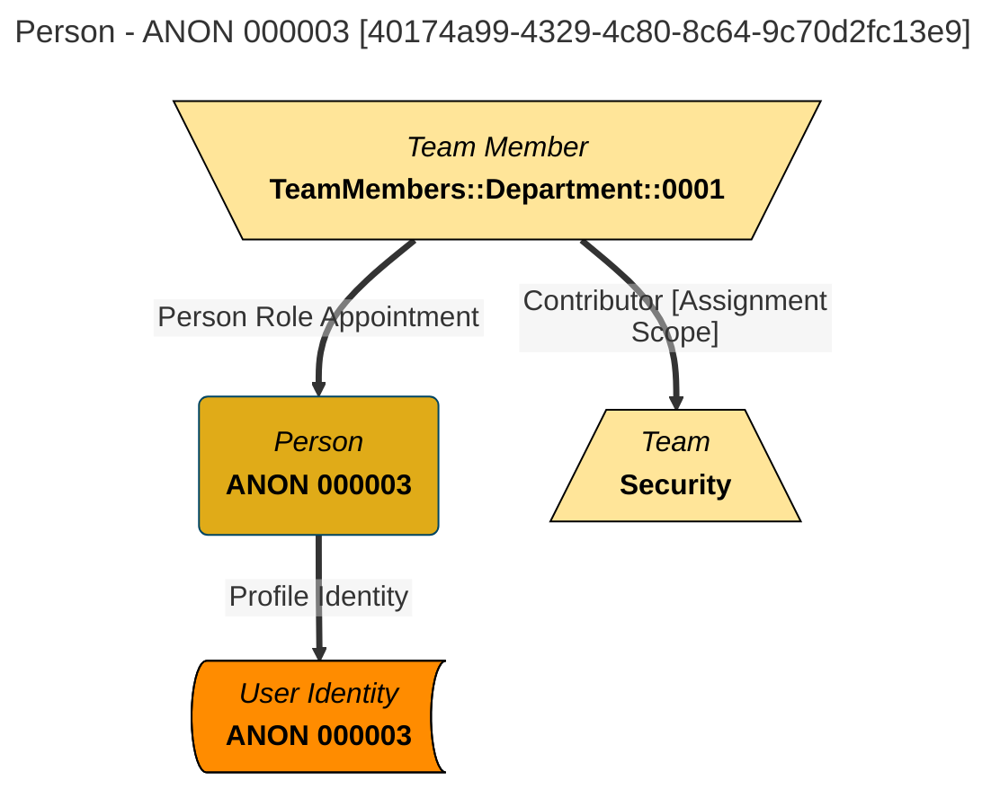

```mermaid
---
title: Person - ANON 000003 [40174a99-4329-4c80-8c64-9c70d2fc13e9]
---
flowchart TD
%%{init: {"flowchart": {"htmlLabels": false}} }%%

1@{ shape: rounded, label: "*Person*
**ANON 000003**"}
2@{ shape: bow-rect, label: "*User Identity*
**ANON 000003**"}
1==>|"Profile Identity"|2
3@{ shape: trap-t, label: "*Team Member*
**TeamMembers::Department::0001**"}
3==>|"Person Role Appointment"|1
4@{ shape: trap-b, label: "*Team*
**Security**"}
3==>|"Contributor [Assignment Scope]"|4
style 1 color:#000000, fill:#e0ab18, stroke:#004563
style 2 color:#000000, fill:#FF8C00, stroke:#000000
style 3 color:#000000, fill:#FFE599, stroke:#000000
style 4 color:#000000, fill:#FFE599, stroke:#000000
```
