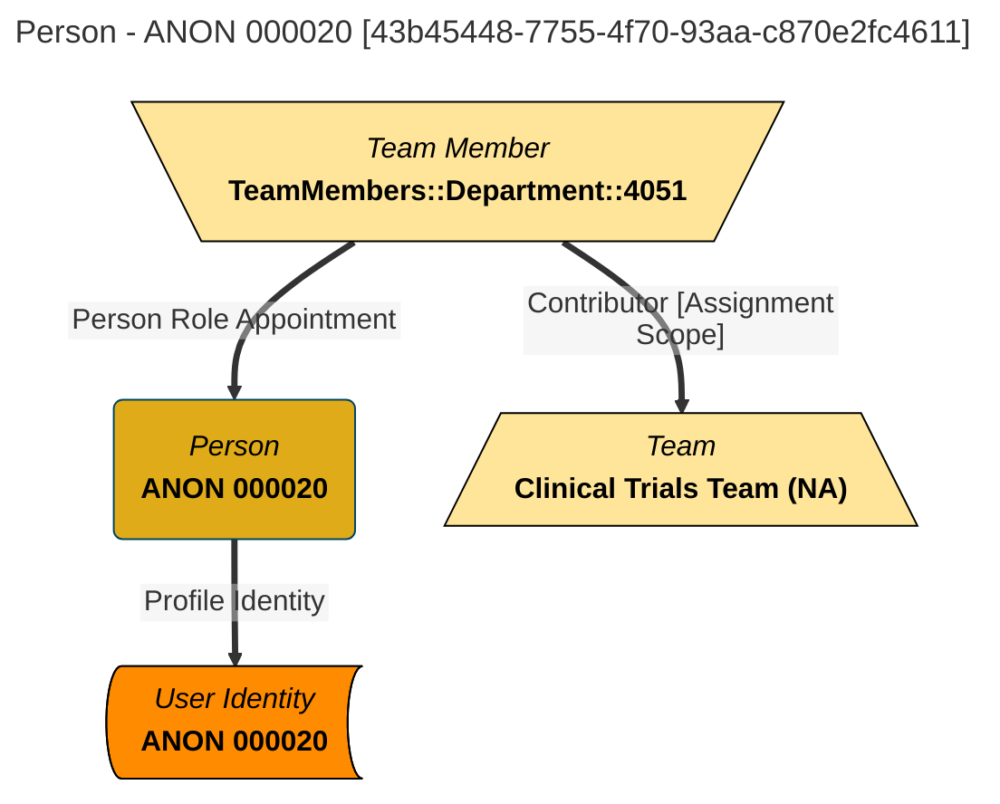

```mermaid
---
title: Person - ANON 000020 [43b45448-7755-4f70-93aa-c870e2fc4611]
---
flowchart TD
%%{init: {"flowchart": {"htmlLabels": false}} }%%

1@{ shape: rounded, label: "*Person*
**ANON 000020**"}
2@{ shape: bow-rect, label: "*User Identity*
**ANON 000020**"}
1==>|"Profile Identity"|2
3@{ shape: trap-t, label: "*Team Member*
**TeamMembers::Department::4051**"}
3==>|"Person Role Appointment"|1
4@{ shape: trap-b, label: "*Team*
**Clinical Trials Team (NA)**"}
3==>|"Contributor [Assignment Scope]"|4
style 1 color:#000000, fill:#e0ab18, stroke:#004563
style 2 color:#000000, fill:#FF8C00, stroke:#000000
style 3 color:#000000, fill:#FFE599, stroke:#000000
style 4 color:#000000, fill:#FFE599, stroke:#000000
```
