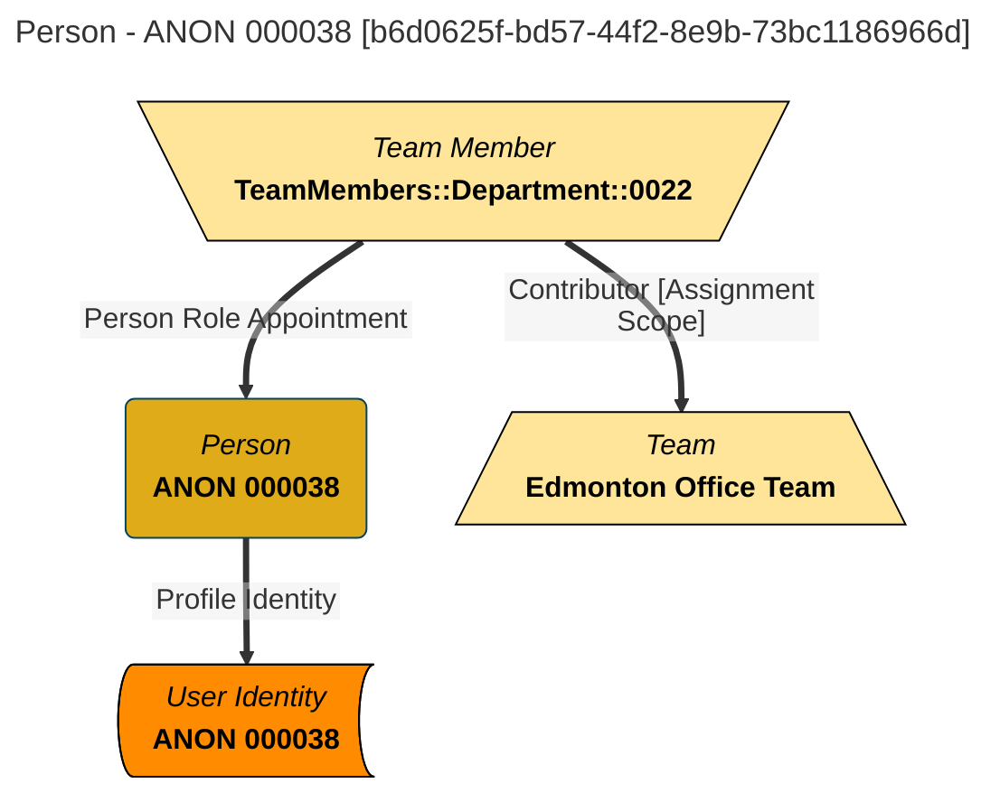

```mermaid
---
title: Person - ANON 000038 [b6d0625f-bd57-44f2-8e9b-73bc1186966d]
---
flowchart TD
%%{init: {"flowchart": {"htmlLabels": false}} }%%

1@{ shape: rounded, label: "*Person*
**ANON 000038**"}
2@{ shape: bow-rect, label: "*User Identity*
**ANON 000038**"}
1==>|"Profile Identity"|2
3@{ shape: trap-t, label: "*Team Member*
**TeamMembers::Department::0022**"}
3==>|"Person Role Appointment"|1
4@{ shape: trap-b, label: "*Team*
**Edmonton Office Team**"}
3==>|"Contributor [Assignment Scope]"|4
style 1 color:#000000, fill:#e0ab18, stroke:#004563
style 2 color:#000000, fill:#FF8C00, stroke:#000000
style 3 color:#000000, fill:#FFE599, stroke:#000000
style 4 color:#000000, fill:#FFE599, stroke:#000000
```
