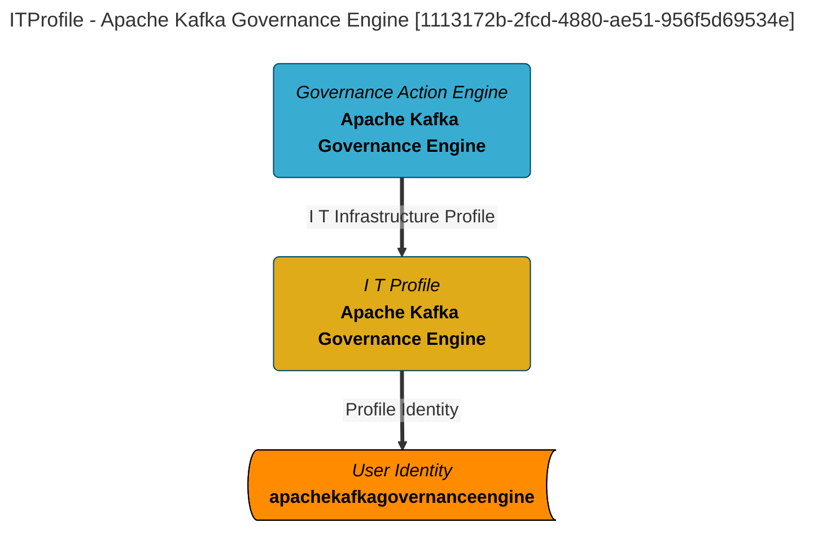

```mermaid
---
title: ITProfile - Apache Kafka Governance Engine [1113172b-2fcd-4880-ae51-956f5d69534e]
---
flowchart TD
%%{init: {"flowchart": {"htmlLabels": false}} }%%

1@{ shape: rounded, label: "*I T Profile*
**Apache Kafka Governance Engine**"}
2@{ shape: bow-rect, label: "*User Identity*
**apachekafkagovernanceengine**"}
1==>|"Profile Identity"|2
3@{ shape: rounded, label: "*Governance Action Engine*
**Apache Kafka Governance Engine**"}
3==>|"I T Infrastructure Profile"|1
style 1 color:#000000, fill:#e0ab18, stroke:#004563
style 2 color:#000000, fill:#FF8C00, stroke:#000000
style 3 color:#000000, fill:#39add1, stroke:#004563
```
> Apache Kafka Governance Engine: Provides specialist governance services to Apache Kafka Servers. (Extracted from 6.0-SNAPSHOT)
