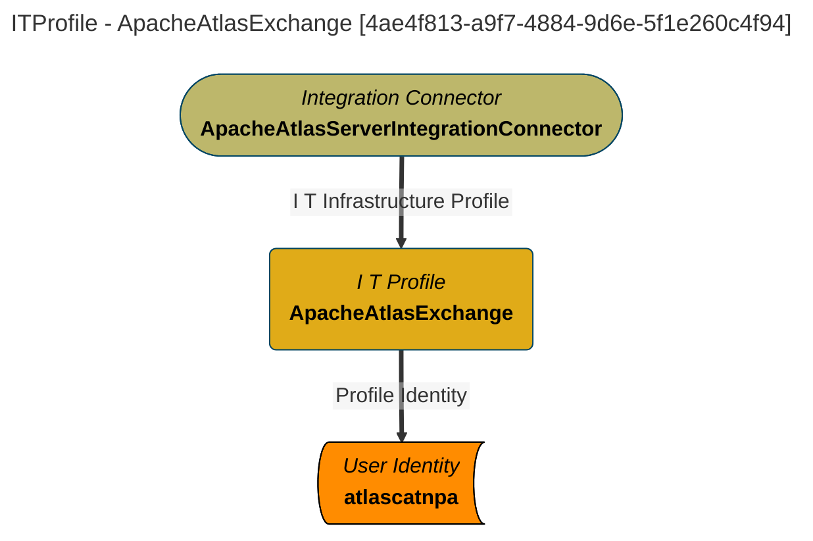

```mermaid
---
title: ITProfile - ApacheAtlasExchange [4ae4f813-a9f7-4884-9d6e-5f1e260c4f94]
---
flowchart TD
%%{init: {"flowchart": {"htmlLabels": false}} }%%

1@{ shape: rounded, label: "*I T Profile*
**ApacheAtlasExchange**"}
2@{ shape: bow-rect, label: "*User Identity*
**atlascatnpa**"}
1==>|"Profile Identity"|2
3@{ shape: stadium, label: "*Integration Connector*
**ApacheAtlasServerIntegrationConnector**"}
3==>|"I T Infrastructure Profile"|1
style 1 color:#000000, fill:#e0ab18, stroke:#004563
style 2 color:#000000, fill:#FF8C00, stroke:#000000
style 3 color:#000000, fill:#BDB76B, stroke:#004563
```
> ApacheAtlasExchange: Exchanges metadata with Apache Atlas metadata catalogs. (Extracted from 6.0-SNAPSHOT)
