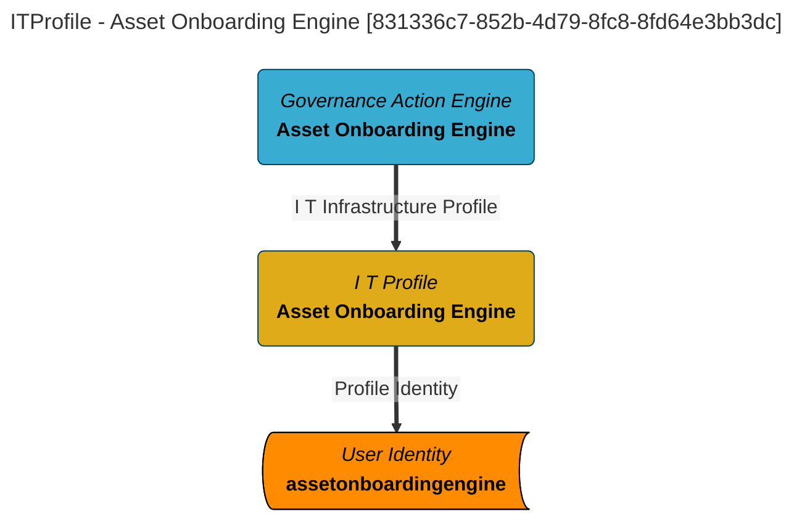

```mermaid
---
title: ITProfile - Asset Onboarding Engine [831336c7-852b-4d79-8fc8-8fd64e3bb3dc]
---
flowchart TD
%%{init: {"flowchart": {"htmlLabels": false}} }%%

1@{ shape: rounded, label: "*I T Profile*
**Asset Onboarding Engine**"}
2@{ shape: bow-rect, label: "*User Identity*
**assetonboardingengine**"}
1==>|"Profile Identity"|2
3@{ shape: rounded, label: "*Governance Action Engine*
**Asset Onboarding Engine**"}
3==>|"I T Infrastructure Profile"|1
style 1 color:#000000, fill:#e0ab18, stroke:#004563
style 2 color:#000000, fill:#FF8C00, stroke:#000000
style 3 color:#000000, fill:#39add1, stroke:#004563
```
> Asset Onboarding Engine: Monitors, validates and enriches metadata relating to assets as they are catalogued. (Extracted from 6.0-SNAPSHOT)
