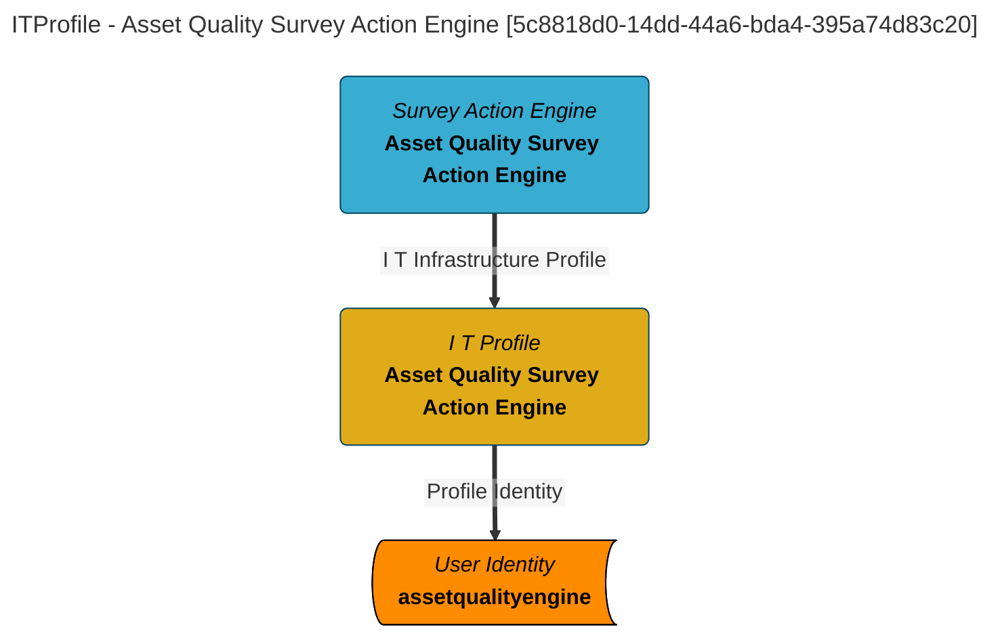

```mermaid
---
title: ITProfile - Asset Quality Survey Action Engine [5c8818d0-14dd-44a6-bda4-395a74d83c20]
---
flowchart TD
%%{init: {"flowchart": {"htmlLabels": false}} }%%

1@{ shape: rounded, label: "*I T Profile*
**Asset Quality Survey Action Engine**"}
2@{ shape: bow-rect, label: "*User Identity*
**assetqualityengine**"}
1==>|"Profile Identity"|2
3@{ shape: rounded, label: "*Survey Action Engine*
**Asset Quality Survey Action Engine**"}
3==>|"I T Infrastructure Profile"|1
style 1 color:#000000, fill:#e0ab18, stroke:#004563
style 2 color:#000000, fill:#FF8C00, stroke:#000000
style 3 color:#000000, fill:#39add1, stroke:#004563
```
> Asset Quality Survey Action Engine: Assess the quality of a digital resource identified by the asset in the request. (Extracted from 6.0-SNAPSHOT)
