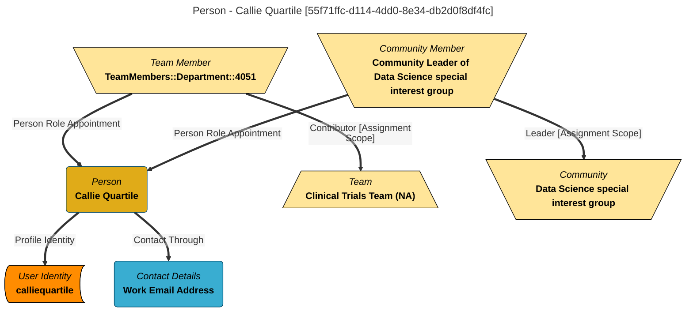

```mermaid
---
title: Person - Callie Quartile [55f71ffc-d114-4dd0-8e34-db2d0f8df4fc]
---
flowchart TD
%%{init: {"flowchart": {"htmlLabels": false}} }%%

1@{ shape: rounded, label: "*Person*
**Callie Quartile**"}
2@{ shape: bow-rect, label: "*User Identity*
**calliequartile**"}
1==>|"Profile Identity"|2
3@{ shape: rounded, label: "*Contact Details*
**Work Email Address**"}
1==>|"Contact Through"|3
4@{ shape: trap-t, label: "*Team Member*
**TeamMembers::Department::4051**"}
4==>|"Person Role Appointment"|1
5@{ shape: trap-b, label: "*Team*
**Clinical Trials Team (NA)**"}
4==>|"Contributor [Assignment Scope]"|5
6@{ shape: trap-t, label: "*Community Member*
**Community Leader of Data Science special interest group**"}
6==>|"Person Role Appointment"|1
7@{ shape: trap-t, label: "*Community*
**Data Science special interest group**"}
6==>|"Leader [Assignment Scope]"|7
style 1 color:#000000, fill:#e0ab18, stroke:#004563
style 2 color:#000000, fill:#FF8C00, stroke:#000000
style 3 color:#000000, fill:#39add1, stroke:#004563
style 4 color:#000000, fill:#FFE599, stroke:#000000
style 5 color:#000000, fill:#FFE599, stroke:#000000
style 6 color:#000000, fill:#FFE599, stroke:#000000
style 7 color:#000000, fill:#FFE599, stroke:#000000
```
