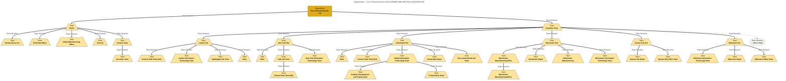

```mermaid
---
title: Organization - Coco Pharmaceuticals Ltd [c3438b90-8dfb-4b8f-86e1-e6300c69e350]
---
flowchart TD
%%{init: {"flowchart": {"htmlLabels": false}} }%%

1@{ shape: rounded, label: "*Organization*
**Coco Pharmaceuticals Ltd**"}
2@{ shape: trap-b, label: "*Team*
**Board**"}
1==>|"Team Structure"|2
3@{ shape: trap-b, label: "*Team*
**Human Resources**"}
2==>|"Team Structure"|3
4@{ shape: trap-b, label: "*Team*
**Chief Data Office**"}
2==>|"Team Structure"|4
5@{ shape: trap-b, label: "*Team*
**Global Manufacturing Office**"}
2==>|"Team Structure"|5
6@{ shape: trap-b, label: "*Team*
**Security**"}
2==>|"Team Structure"|6
7@{ shape: trap-b, label: "*Team*
**Finance Team**"}
2==>|"Team Structure"|7
8@{ shape: trap-b, label: "*Team*
**Accounts Team**"}
7==>|"Team Structure"|8
9@{ shape: trap-b, label: "*Team*
**Founders Team**"}
1==>|"Team Structure"|9
10@{ shape: trap-b, label: "*Team*
**London Site**"}
9==>|"Team Structure"|10
11@{ shape: trap-b, label: "*Team*
**Clinical Trials Team (UK)**"}
10==>|"Team Structure"|11
12@{ shape: trap-b, label: "*Team*
**London Information Technology Team**"}
10==>|"Team Structure"|12
13@{ shape: trap-b, label: "*Team*
**Nightingale Lab Team**"}
10==>|"Team Structure"|13
14@{ shape: trap-b, label: "*Team*
**Sales**"}
10==>|"Team Structure"|14
15@{ shape: trap-b, label: "*Team*
**New York Site**"}
9==>|"Team Structure"|15
16@{ shape: trap-b, label: "*Team*
**Sales**"}
15==>|"Team Structure"|16
17@{ shape: trap-b, label: "*Team*
**Salk Lab Team**"}
15==>|"Team Structure"|17
18@{ shape: trap-b, label: "*Team*
**Clinical Trials Team (NA)**"}
17==>|"Team Structure"|18
19@{ shape: trap-b, label: "*Team*
**New York Information Technology Team**"}
15==>|"Team Structure"|19
20@{ shape: trap-b, label: "*Team*
**Amsterdam Site**"}
9==>|"Team Structure"|20
21@{ shape: trap-b, label: "*Team*
**Sales**"}
20==>|"Team Structure"|21
22@{ shape: trap-b, label: "*Team*
**Clinical Trials Team (EU)**"}
20==>|"Team Structure"|22
23@{ shape: trap-b, label: "*Team*
**Global Information Technology Team**"}
20==>|"Team Structure"|23
24@{ shape: trap-b, label: "*Team*
**Software Development and Testing Team**"}
23==>|"Team Structure"|24
25@{ shape: trap-b, label: "*Team*
**IT Operations Team**"}
23==>|"Team Structure"|25
26@{ shape: trap-b, label: "*Team*
**Amsterdam Depot**"}
20==>|"Team Structure"|26
27@{ shape: trap-b, label: "*Team*
**Van Leeuwenhoek Lab Team**"}
20==>|"Team Structure"|27
28@{ shape: trap-b, label: "*Team*
**Winchester Site**"}
9==>|"Team Structure"|28
29@{ shape: trap-b, label: "*Team*
**Winchester Manufacturing Office**"}
28==>|"Team Structure"|29
30@{ shape: trap-b, label: "*Team*
**Winchester Manufacturing Office**"}
29==>|"Team Structure"|30
31@{ shape: trap-b, label: "*Team*
**Winchester Depot**"}
28==>|"Team Structure"|31
32@{ shape: trap-b, label: "*Team*
**Winchester Manufacturing**"}
28==>|"Team Structure"|32
33@{ shape: trap-b, label: "*Team*
**Winchester Information Technology Team**"}
28==>|"Team Structure"|33
34@{ shape: trap-b, label: "*Team*
**Kansas City Site**"}
9==>|"Team Structure"|34
35@{ shape: trap-b, label: "*Team*
**Kansas City Depot**"}
34==>|"Team Structure"|35
36@{ shape: trap-b, label: "*Team*
**Kansas City Office Team**"}
34==>|"Team Structure"|36
37@{ shape: trap-b, label: "*Team*
**Edmonton Site**"}
9==>|"Team Structure"|37
38@{ shape: trap-b, label: "*Team*
**Edmonton Information Technology Team**"}
37==>|"Team Structure"|38
39@{ shape: trap-b, label: "*Team*
**Edmonton Depot**"}
37==>|"Team Structure"|39
40@{ shape: trap-b, label: "*Team*
**Edmonton Office Team**"}
37==>|"Team Structure"|40
41@{ shape: stadium, label: "*Team Structure*
**... plus 1 Items**"}
9-.->41
style 22 color:#000000, fill:#FFE599, stroke:#000000
style 23 color:#000000, fill:#FFE599, stroke:#000000
style 24 color:#000000, fill:#FFE599, stroke:#000000
style 25 color:#000000, fill:#FFE599, stroke:#000000
style 26 color:#000000, fill:#FFE599, stroke:#000000
style 27 color:#000000, fill:#FFE599, stroke:#000000
style 28 color:#000000, fill:#FFE599, stroke:#000000
style 29 color:#000000, fill:#FFE599, stroke:#000000
style 30 color:#000000, fill:#FFE599, stroke:#000000
style 31 color:#000000, fill:#FFE599, stroke:#000000
style 10 color:#000000, fill:#FFE599, stroke:#000000
style 32 color:#000000, fill:#FFE599, stroke:#000000
style 11 color:#000000, fill:#FFE599, stroke:#000000
style 33 color:#000000, fill:#FFE599, stroke:#000000
style 12 color:#000000, fill:#FFE599, stroke:#000000
style 34 color:#000000, fill:#FFE599, stroke:#000000
style 13 color:#000000, fill:#FFE599, stroke:#000000
style 35 color:#000000, fill:#FFE599, stroke:#000000
style 14 color:#000000, fill:#FFE599, stroke:#000000
style 36 color:#000000, fill:#FFE599, stroke:#000000
style 15 color:#000000, fill:#FFE599, stroke:#000000
style 37 color:#000000, fill:#FFE599, stroke:#000000
style 16 color:#000000, fill:#FFE599, stroke:#000000
style 38 color:#000000, fill:#FFE599, stroke:#000000
style 17 color:#000000, fill:#FFE599, stroke:#000000
style 39 color:#000000, fill:#FFE599, stroke:#000000
style 18 color:#000000, fill:#FFE599, stroke:#000000
style 19 color:#000000, fill:#FFE599, stroke:#000000
style 1 color:#000000, fill:#e0ab18, stroke:#004563
style 2 color:#000000, fill:#FFE599, stroke:#000000
style 3 color:#000000, fill:#FFE599, stroke:#000000
style 4 color:#000000, fill:#FFE599, stroke:#000000
style 5 color:#000000, fill:#FFE599, stroke:#000000
style 6 color:#000000, fill:#FFE599, stroke:#000000
style 7 color:#000000, fill:#FFE599, stroke:#000000
style 8 color:#000000, fill:#FFE599, stroke:#000000
style 9 color:#000000, fill:#FFE599, stroke:#000000
style 40 color:#000000, fill:#FFE599, stroke:#000000
style 41 color:#000000, fill:#F9F7ED, stroke:#b7c0c7
style 20 color:#000000, fill:#FFE599, stroke:#000000
style 21 color:#000000, fill:#FFE599, stroke:#000000
```
