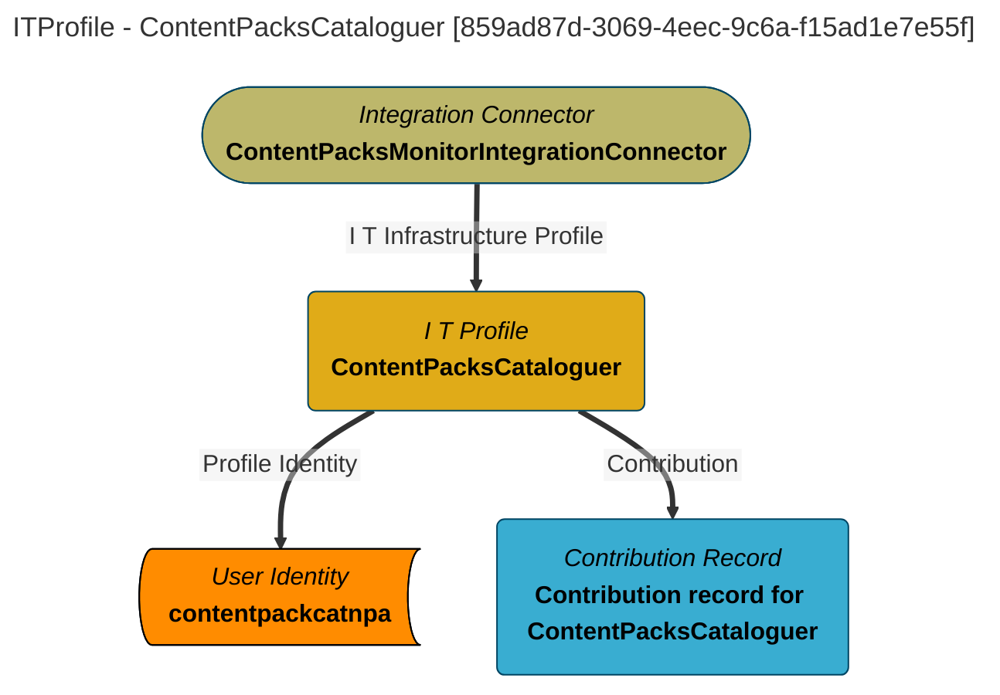

```mermaid
---
title: ITProfile - ContentPacksCataloguer [859ad87d-3069-4eec-9c6a-f15ad1e7e55f]
---
flowchart TD
%%{init: {"flowchart": {"htmlLabels": false}} }%%

1@{ shape: rounded, label: "*I T Profile*
**ContentPacksCataloguer**"}
2@{ shape: bow-rect, label: "*User Identity*
**contentpackcatnpa**"}
1==>|"Profile Identity"|2
3@{ shape: stadium, label: "*Integration Connector*
**ContentPacksMonitorIntegrationConnector**"}
3==>|"I T Infrastructure Profile"|1
4@{ shape: rounded, label: "*Contribution Record*
**Contribution record for ContentPacksCataloguer**"}
1==>|"Contribution"|4
style 1 color:#000000, fill:#e0ab18, stroke:#004563
style 2 color:#000000, fill:#FF8C00, stroke:#000000
style 3 color:#000000, fill:#BDB76B, stroke:#004563
style 4 color:#000000, fill:#39add1, stroke:#004563
```
> ContentPacksCataloguer: Catalogs Open Metadata Archive files found under the content-packs directory (folder) and any other folder added as a catalog target. (Extracted from 6.0-SNAPSHOT)
