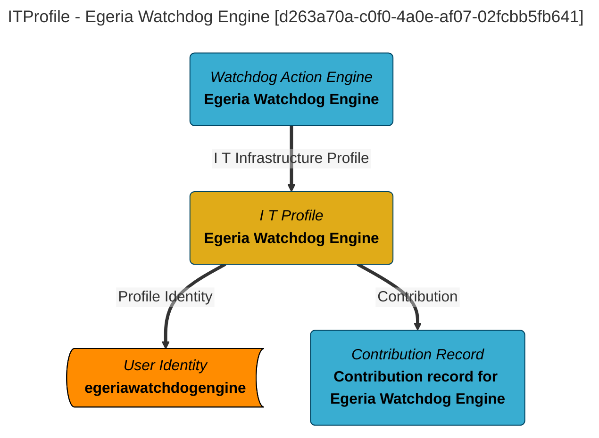

```mermaid
---
title: ITProfile - Egeria Watchdog Engine [d263a70a-c0f0-4a0e-af07-02fcbb5fb641]
---
flowchart TD
%%{init: {"flowchart": {"htmlLabels": false}} }%%

1@{ shape: rounded, label: "*I T Profile*
**Egeria Watchdog Engine**"}
2@{ shape: bow-rect, label: "*User Identity*
**egeriawatchdogengine**"}
1==>|"Profile Identity"|2
3@{ shape: rounded, label: "*Watchdog Action Engine*
**Egeria Watchdog Engine**"}
3==>|"I T Infrastructure Profile"|1
4@{ shape: rounded, label: "*Contribution Record*
**Contribution record for Egeria Watchdog Engine**"}
1==>|"Contribution"|4
style 1 color:#000000, fill:#e0ab18, stroke:#004563
style 2 color:#000000, fill:#FF8C00, stroke:#000000
style 3 color:#000000, fill:#39add1, stroke:#004563
style 4 color:#000000, fill:#39add1, stroke:#004563
```
> Egeria Watchdog Engine: Provides standard watchdog services to Egeria''s OMAG Server Platform and Servers. (Extracted from 6.0-SNAPSHOT)
