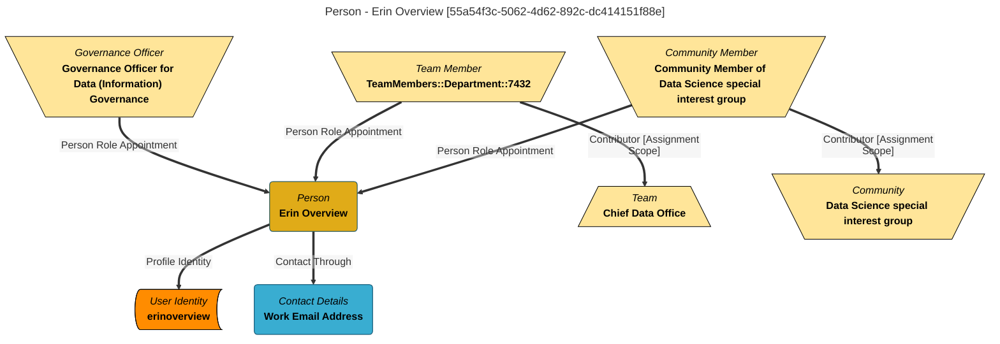

```mermaid
---
title: Person - Erin Overview [55a54f3c-5062-4d62-892c-dc414151f88e]
---
flowchart TD
%%{init: {"flowchart": {"htmlLabels": false}} }%%

1@{ shape: rounded, label: "*Person*
**Erin Overview**"}
2@{ shape: bow-rect, label: "*User Identity*
**erinoverview**"}
1==>|"Profile Identity"|2
3@{ shape: rounded, label: "*Contact Details*
**Work Email Address**"}
1==>|"Contact Through"|3
4@{ shape: trap-t, label: "*Governance Officer*
**Governance Officer for Data (Information) Governance**"}
4==>|"Person Role Appointment"|1
5@{ shape: trap-t, label: "*Team Member*
**TeamMembers::Department::7432**"}
5==>|"Person Role Appointment"|1
6@{ shape: trap-b, label: "*Team*
**Chief Data Office**"}
5==>|"Contributor [Assignment Scope]"|6
7@{ shape: trap-t, label: "*Community Member*
**Community Member of Data Science special interest group**"}
7==>|"Person Role Appointment"|1
8@{ shape: trap-t, label: "*Community*
**Data Science special interest group**"}
7==>|"Contributor [Assignment Scope]"|8
style 1 color:#000000, fill:#e0ab18, stroke:#004563
style 2 color:#000000, fill:#FF8C00, stroke:#000000
style 3 color:#000000, fill:#39add1, stroke:#004563
style 4 color:#000000, fill:#FFE599, stroke:#000000
style 5 color:#000000, fill:#FFE599, stroke:#000000
style 6 color:#000000, fill:#FFE599, stroke:#000000
style 7 color:#000000, fill:#FFE599, stroke:#000000
style 8 color:#000000, fill:#FFE599, stroke:#000000
```
