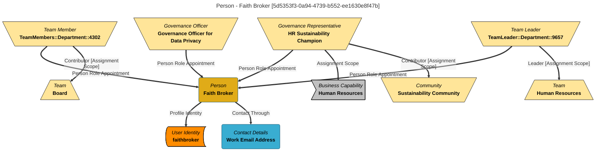

```mermaid
---
title: Person - Faith Broker [5d5353f3-0a94-4739-b552-ee1630e8f47b]
---
flowchart TD
%%{init: {"flowchart": {"htmlLabels": false}} }%%

1@{ shape: rounded, label: "*Person*
**Faith Broker**"}
2@{ shape: bow-rect, label: "*User Identity*
**faithbroker**"}
1==>|"Profile Identity"|2
3@{ shape: rounded, label: "*Contact Details*
**Work Email Address**"}
1==>|"Contact Through"|3
4@{ shape: trap-t, label: "*Team Member*
**TeamMembers::Department::4302**"}
4==>|"Person Role Appointment"|1
5@{ shape: trap-b, label: "*Team*
**Board**"}
4==>|"Contributor [Assignment Scope]"|5
6@{ shape: trap-t, label: "*Governance Representative*
**HR Sustainability Champion**"}
6==>|"Person Role Appointment"|1
7@{ shape: odd, label: "*Business Capability*
**Human Resources**"}
6==>|"Assignment Scope"|7
8@{ shape: trap-t, label: "*Community*
**Sustainability Community**"}
6==>|"Contributor [Assignment Scope]"|8
9@{ shape: trap-t, label: "*Governance Officer*
**Governance Officer for Data Privacy**"}
9==>|"Person Role Appointment"|1
10@{ shape: trap-t, label: "*Team Leader*
**TeamLeader::Department::9657**"}
10==>|"Person Role Appointment"|1
11@{ shape: trap-b, label: "*Team*
**Human Resources**"}
10==>|"Leader [Assignment Scope]"|11
style 11 color:#000000, fill:#FFE599, stroke:#000000
style 1 color:#000000, fill:#e0ab18, stroke:#004563
style 2 color:#000000, fill:#FF8C00, stroke:#000000
style 3 color:#000000, fill:#39add1, stroke:#004563
style 4 color:#000000, fill:#FFE599, stroke:#000000
style 5 color:#000000, fill:#FFE599, stroke:#000000
style 6 color:#000000, fill:#FFE599, stroke:#000000
style 7 color:#000000, fill:#C0C0C0, stroke:#000000
style 8 color:#000000, fill:#FFE599, stroke:#000000
style 9 color:#000000, fill:#FFE599, stroke:#000000
style 10 color:#000000, fill:#FFE599, stroke:#000000
```
