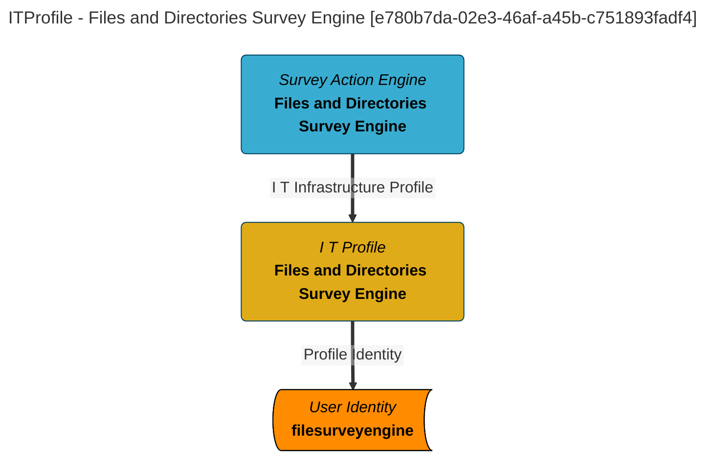

```mermaid
---
title: ITProfile - Files and Directories Survey Engine [e780b7da-02e3-46af-a45b-c751893fadf4]
---
flowchart TD
%%{init: {"flowchart": {"htmlLabels": false}} }%%

1@{ shape: rounded, label: "*I T Profile*
**Files and Directories Survey Engine**"}
2@{ shape: bow-rect, label: "*User Identity*
**filesurveyengine**"}
1==>|"Profile Identity"|2
3@{ shape: rounded, label: "*Survey Action Engine*
**Files and Directories Survey Engine**"}
3==>|"I T Infrastructure Profile"|1
style 1 color:#000000, fill:#e0ab18, stroke:#004563
style 2 color:#000000, fill:#FF8C00, stroke:#000000
style 3 color:#000000, fill:#39add1, stroke:#004563
```
> Files and Directories Survey Engine: Provides specialist surveys on Files and Directories. (Extracted from 6.0-SNAPSHOT)
