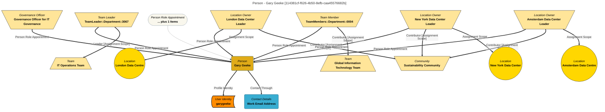

```mermaid
---
title: Person - Gary Geeke [114381cf-f626-4b50-8efb-caa45576682b]
---
flowchart TD
%%{init: {"flowchart": {"htmlLabels": false}} }%%

1@{ shape: rounded, label: "*Person*
**Gary Geeke**"}
2@{ shape: bow-rect, label: "*User Identity*
**garygeeke**"}
1==>|"Profile Identity"|2
3@{ shape: rounded, label: "*Contact Details*
**Work Email Address**"}
1==>|"Contact Through"|3
4@{ shape: trap-t, label: "*Team Leader*
**TeamLeader::Department::3067**"}
4==>|"Person Role Appointment"|1
5@{ shape: trap-b, label: "*Team*
**IT Operations Team**"}
4==>|"Leader [Assignment Scope]"|5
6@{ shape: trap-t, label: "*Governance Officer*
**Governance Officer for IT Governance**"}
6==>|"Person Role Appointment"|1
7@{ shape: trap-t, label: "*Location Owner*
**London Data Center Leader**"}
7==>|"Person Role Appointment"|1
8@{ shape: circle, label: "*Location*
**London Data Centre**"}
7==>|"Assignment Scope"|8
9@{ shape: trap-t, label: "*Community*
**Sustainability Community**"}
7==>|"Contributor [Assignment Scope]"|9
10@{ shape: trap-t, label: "*Team Member*
**TeamMembers::Department::0004**"}
10==>|"Person Role Appointment"|1
11@{ shape: trap-b, label: "*Team*
**Global Information Technology Team**"}
10==>|"Contributor [Assignment Scope]"|11
12@{ shape: trap-t, label: "*Location Owner*
**New York Data Center Leader**"}
12==>|"Person Role Appointment"|1
12==>|"Contributor [Assignment Scope]"|9
13@{ shape: circle, label: "*Location*
**New York Data Center**"}
12==>|"Assignment Scope"|13
14@{ shape: trap-t, label: "*Location Owner*
**Amsterdam Data Center Leader**"}
14==>|"Person Role Appointment"|1
14==>|"Contributor [Assignment Scope]"|9
15@{ shape: circle, label: "*Location*
**Amsterdam Data Centre**"}
14==>|"Assignment Scope"|15
16@{ shape: stadium, label: "*Person Role Appointment*
**... plus 1 Items**"}
16-.->1
style 11 color:#000000, fill:#FFE599, stroke:#000000
style 12 color:#000000, fill:#FFE599, stroke:#000000
style 13 color:#000000, fill:#FFD700, stroke:#000000
style 14 color:#000000, fill:#FFE599, stroke:#000000
style 15 color:#000000, fill:#FFD700, stroke:#000000
style 16 color:#000000, fill:#F9F7ED, stroke:#b7c0c7
style 1 color:#000000, fill:#e0ab18, stroke:#004563
style 2 color:#000000, fill:#FF8C00, stroke:#000000
style 3 color:#000000, fill:#39add1, stroke:#004563
style 4 color:#000000, fill:#FFE599, stroke:#000000
style 5 color:#000000, fill:#FFE599, stroke:#000000
style 6 color:#000000, fill:#FFE599, stroke:#000000
style 7 color:#000000, fill:#FFE599, stroke:#000000
style 8 color:#000000, fill:#FFD700, stroke:#000000
style 9 color:#000000, fill:#FFE599, stroke:#000000
style 10 color:#000000, fill:#FFE599, stroke:#000000
```
