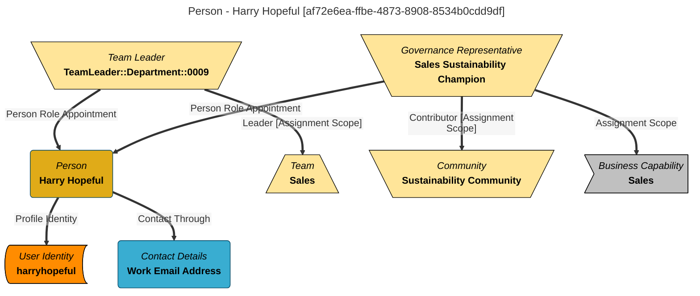

```mermaid
---
title: Person - Harry Hopeful [af72e6ea-ffbe-4873-8908-8534b0cdd9df]
---
flowchart TD
%%{init: {"flowchart": {"htmlLabels": false}} }%%

1@{ shape: rounded, label: "*Person*
**Harry Hopeful**"}
2@{ shape: bow-rect, label: "*User Identity*
**harryhopeful**"}
1==>|"Profile Identity"|2
3@{ shape: rounded, label: "*Contact Details*
**Work Email Address**"}
1==>|"Contact Through"|3
4@{ shape: trap-t, label: "*Team Leader*
**TeamLeader::Department::0009**"}
4==>|"Person Role Appointment"|1
5@{ shape: trap-b, label: "*Team*
**Sales**"}
4==>|"Leader [Assignment Scope]"|5
6@{ shape: trap-t, label: "*Governance Representative*
**Sales Sustainability Champion**"}
6==>|"Person Role Appointment"|1
7@{ shape: trap-t, label: "*Community*
**Sustainability Community**"}
6==>|"Contributor [Assignment Scope]"|7
8@{ shape: odd, label: "*Business Capability*
**Sales**"}
6==>|"Assignment Scope"|8
style 1 color:#000000, fill:#e0ab18, stroke:#004563
style 2 color:#000000, fill:#FF8C00, stroke:#000000
style 3 color:#000000, fill:#39add1, stroke:#004563
style 4 color:#000000, fill:#FFE599, stroke:#000000
style 5 color:#000000, fill:#FFE599, stroke:#000000
style 6 color:#000000, fill:#FFE599, stroke:#000000
style 7 color:#000000, fill:#FFE599, stroke:#000000
style 8 color:#000000, fill:#C0C0C0, stroke:#000000
```
