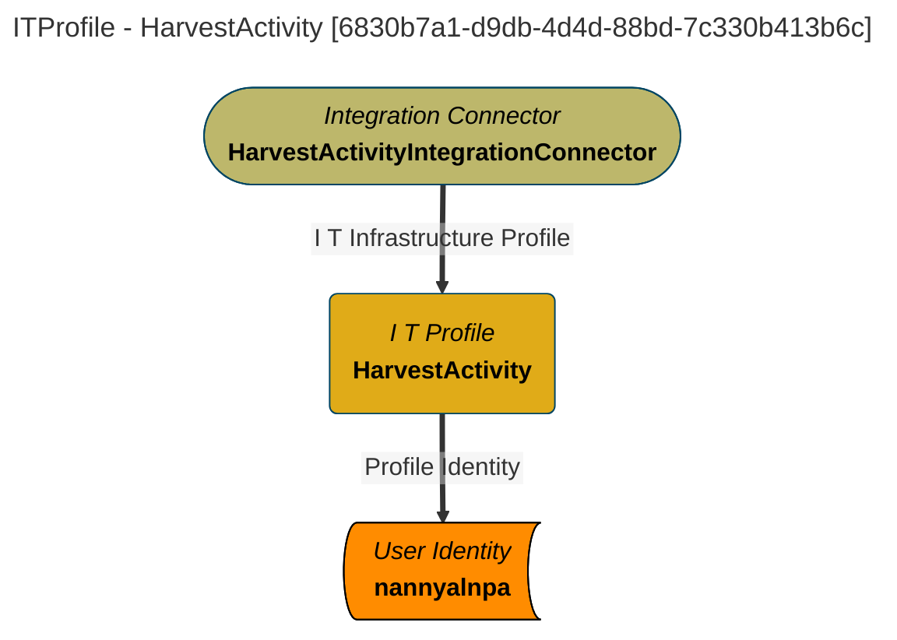

```mermaid
---
title: ITProfile - HarvestActivity [6830b7a1-d9db-4d4d-88bd-7c330b413b6c]
---
flowchart TD
%%{init: {"flowchart": {"htmlLabels": false}} }%%

1@{ shape: rounded, label: "*I T Profile*
**HarvestActivity**"}
2@{ shape: bow-rect, label: "*User Identity*
**nannyalnpa**"}
1==>|"Profile Identity"|2
3@{ shape: stadium, label: "*Integration Connector*
**HarvestActivityIntegrationConnector**"}
3==>|"I T Infrastructure Profile"|1
style 1 color:#000000, fill:#e0ab18, stroke:#004563
style 2 color:#000000, fill:#FF8C00, stroke:#000000
style 3 color:#000000, fill:#BDB76B, stroke:#004563
```
> HarvestActivity: Listens for audit log records published through specific Apache Kafka Topics and populates a PostgreSQL database schema or folder. (Extracted from 6.0-SNAPSHOT)
