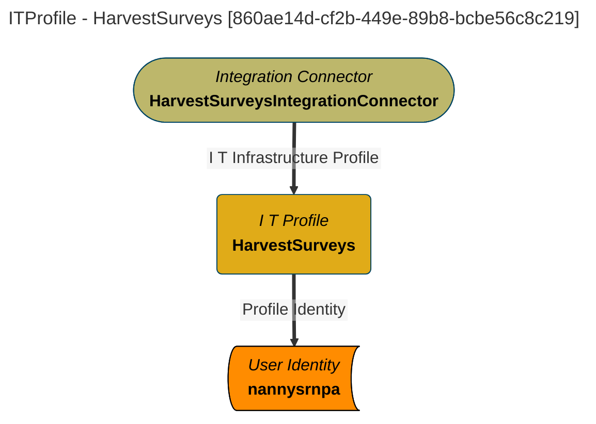

```mermaid
---
title: ITProfile - HarvestSurveys [860ae14d-cf2b-449e-89b8-bcbe56c8c219]
---
flowchart TD
%%{init: {"flowchart": {"htmlLabels": false}} }%%

1@{ shape: rounded, label: "*I T Profile*
**HarvestSurveys**"}
2@{ shape: bow-rect, label: "*User Identity*
**nannysrnpa**"}
1==>|"Profile Identity"|2
3@{ shape: stadium, label: "*Integration Connector*
**HarvestSurveysIntegrationConnector**"}
3==>|"I T Infrastructure Profile"|1
style 1 color:#000000, fill:#e0ab18, stroke:#004563
style 2 color:#000000, fill:#FF8C00, stroke:#000000
style 3 color:#000000, fill:#BDB76B, stroke:#004563
```
> HarvestSurveys: Scans for new survey reports in the open metadata ecosystem and populates a PostgreSQL database schema. (Extracted from 6.0-SNAPSHOT)
