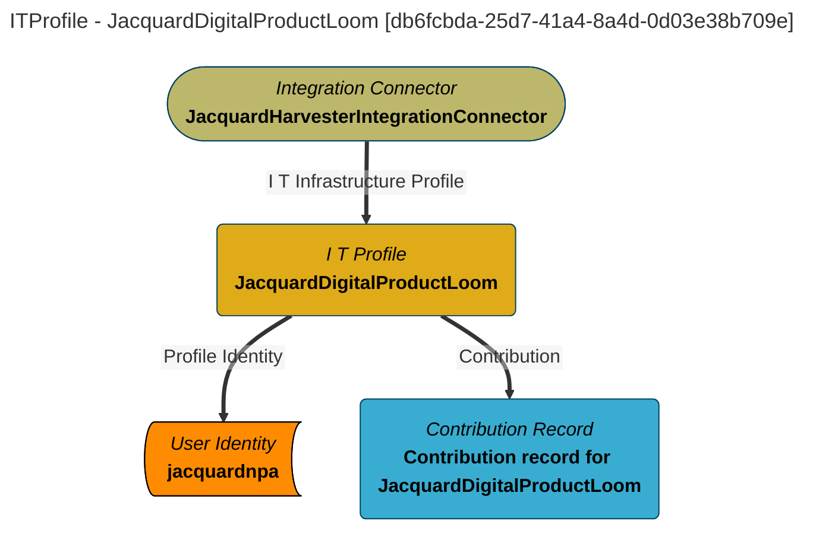

```mermaid
---
title: ITProfile - JacquardDigitalProductLoom [db6fcbda-25d7-41a4-8a4d-0d03e38b709e]
---
flowchart TD
%%{init: {"flowchart": {"htmlLabels": false}} }%%

1@{ shape: rounded, label: "*I T Profile*
**JacquardDigitalProductLoom**"}
2@{ shape: bow-rect, label: "*User Identity*
**jacquardnpa**"}
1==>|"Profile Identity"|2
3@{ shape: stadium, label: "*Integration Connector*
**JacquardHarvesterIntegrationConnector**"}
3==>|"I T Infrastructure Profile"|1
4@{ shape: rounded, label: "*Contribution Record*
**Contribution record for JacquardDigitalProductLoom**"}
1==>|"Contribution"|4
style 1 color:#000000, fill:#e0ab18, stroke:#004563
style 2 color:#000000, fill:#FF8C00, stroke:#000000
style 3 color:#000000, fill:#BDB76B, stroke:#004563
style 4 color:#000000, fill:#39add1, stroke:#004563
```
> JacquardDigitalProductLoom: Defines and maintains digital products based on the content of the open metadata repositories. (Extracted from 6.0-SNAPSHOT)
