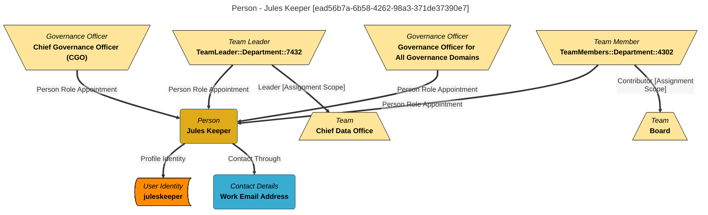

```mermaid
---
title: Person - Jules Keeper [ead56b7a-6b58-4262-98a3-371de37390e7]
---
flowchart TD
%%{init: {"flowchart": {"htmlLabels": false}} }%%

1@{ shape: rounded, label: "*Person*
**Jules Keeper**"}
2@{ shape: bow-rect, label: "*User Identity*
**juleskeeper**"}
1==>|"Profile Identity"|2
3@{ shape: rounded, label: "*Contact Details*
**Work Email Address**"}
1==>|"Contact Through"|3
4@{ shape: trap-t, label: "*Governance Officer*
**Chief Governance Officer (CGO)**"}
4==>|"Person Role Appointment"|1
5@{ shape: trap-t, label: "*Team Leader*
**TeamLeader::Department::7432**"}
5==>|"Person Role Appointment"|1
6@{ shape: trap-b, label: "*Team*
**Chief Data Office**"}
5==>|"Leader [Assignment Scope]"|6
7@{ shape: trap-t, label: "*Team Member*
**TeamMembers::Department::4302**"}
7==>|"Person Role Appointment"|1
8@{ shape: trap-b, label: "*Team*
**Board**"}
7==>|"Contributor [Assignment Scope]"|8
9@{ shape: trap-t, label: "*Governance Officer*
**Governance Officer for All Governance Domains**"}
9==>|"Person Role Appointment"|1
style 1 color:#000000, fill:#e0ab18, stroke:#004563
style 2 color:#000000, fill:#FF8C00, stroke:#000000
style 3 color:#000000, fill:#39add1, stroke:#004563
style 4 color:#000000, fill:#FFE599, stroke:#000000
style 5 color:#000000, fill:#FFE599, stroke:#000000
style 6 color:#000000, fill:#FFE599, stroke:#000000
style 7 color:#000000, fill:#FFE599, stroke:#000000
style 8 color:#000000, fill:#FFE599, stroke:#000000
style 9 color:#000000, fill:#FFE599, stroke:#000000
```
