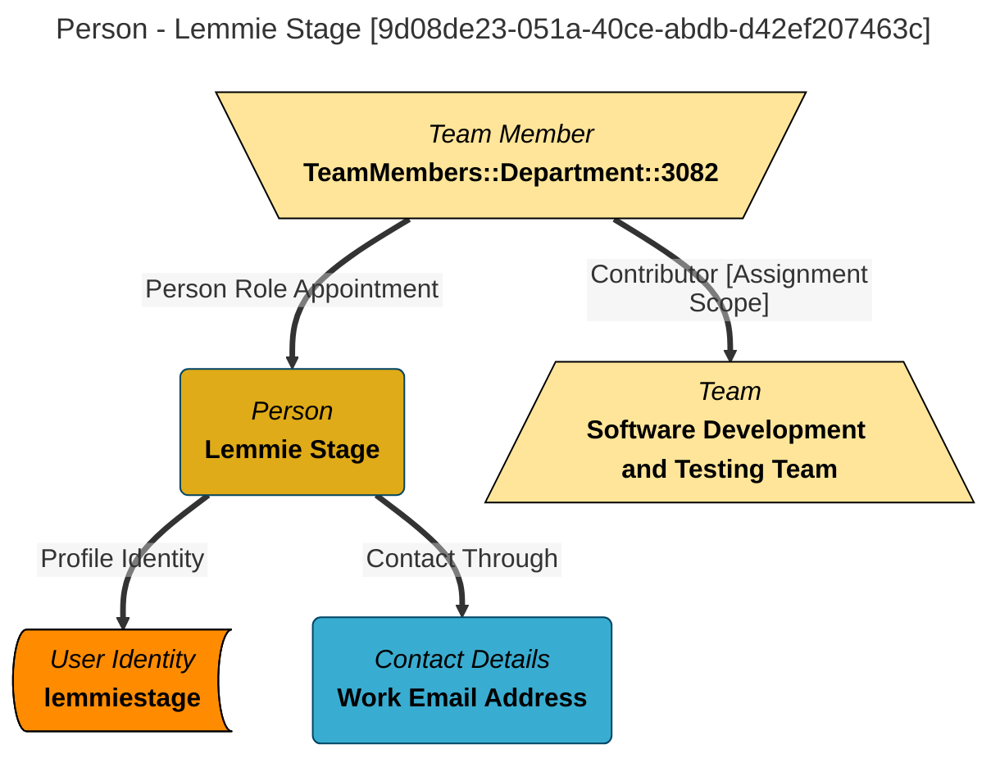

```mermaid
---
title: Person - Lemmie Stage [9d08de23-051a-40ce-abdb-d42ef207463c]
---
flowchart TD
%%{init: {"flowchart": {"htmlLabels": false}} }%%

1@{ shape: rounded, label: "*Person*
**Lemmie Stage**"}
2@{ shape: bow-rect, label: "*User Identity*
**lemmiestage**"}
1==>|"Profile Identity"|2
3@{ shape: rounded, label: "*Contact Details*
**Work Email Address**"}
1==>|"Contact Through"|3
4@{ shape: trap-t, label: "*Team Member*
**TeamMembers::Department::3082**"}
4==>|"Person Role Appointment"|1
5@{ shape: trap-b, label: "*Team*
**Software Development and Testing Team**"}
4==>|"Contributor [Assignment Scope]"|5
style 1 color:#000000, fill:#e0ab18, stroke:#004563
style 2 color:#000000, fill:#FF8C00, stroke:#000000
style 3 color:#000000, fill:#39add1, stroke:#004563
style 4 color:#000000, fill:#FFE599, stroke:#000000
style 5 color:#000000, fill:#FFE599, stroke:#000000
```
