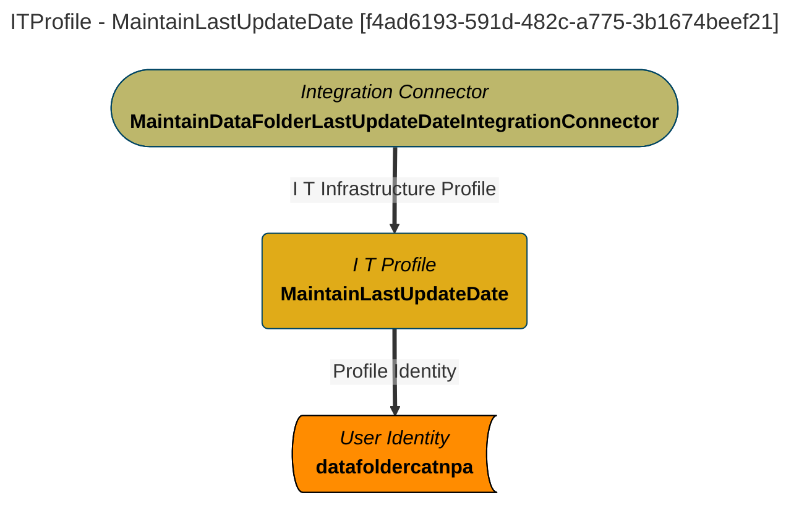

```mermaid
---
title: ITProfile - MaintainLastUpdateDate [f4ad6193-591d-482c-a775-3b1674beef21]
---
flowchart TD
%%{init: {"flowchart": {"htmlLabels": false}} }%%

1@{ shape: rounded, label: "*I T Profile*
**MaintainLastUpdateDate**"}
2@{ shape: bow-rect, label: "*User Identity*
**datafoldercatnpa**"}
1==>|"Profile Identity"|2
3@{ shape: stadium, label: "*Integration Connector*
**MaintainDataFolderLastUpdateDateIntegrationConnector**"}
3==>|"I T Infrastructure Profile"|1
style 1 color:#000000, fill:#e0ab18, stroke:#004563
style 2 color:#000000, fill:#FF8C00, stroke:#000000
style 3 color:#000000, fill:#BDB76B, stroke:#004563
```
> MaintainLastUpdateDate: Maintains the last update date in a data folder asset based on the file activity in the resource''s directory. (Extracted from 6.0-SNAPSHOT)
