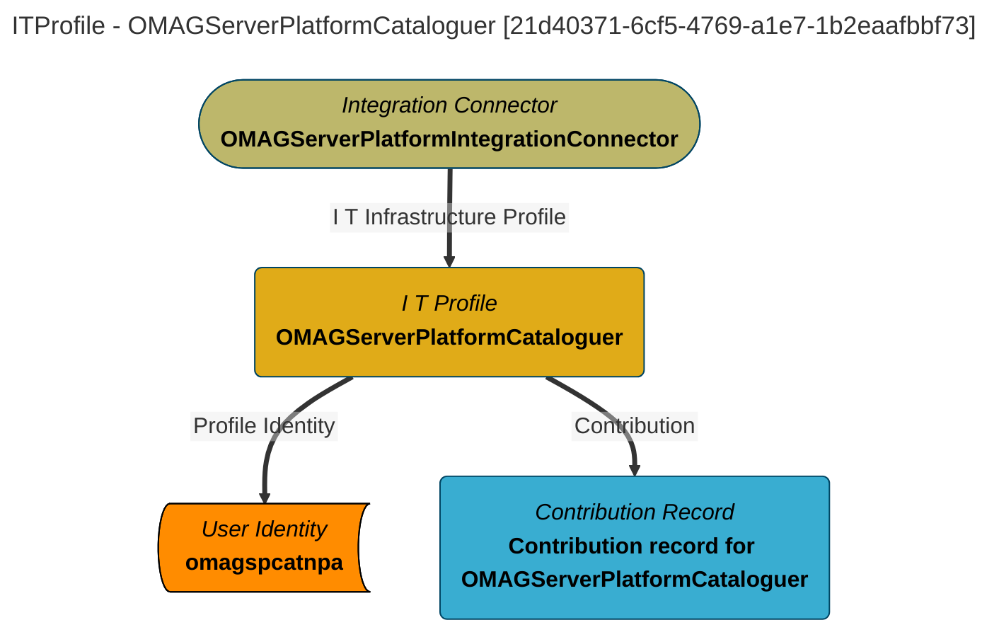

```mermaid
---
title: ITProfile - OMAGServerPlatformCataloguer [21d40371-6cf5-4769-a1e7-1b2eaafbbf73]
---
flowchart TD
%%{init: {"flowchart": {"htmlLabels": false}} }%%

1@{ shape: rounded, label: "*I T Profile*
**OMAGServerPlatformCataloguer**"}
2@{ shape: bow-rect, label: "*User Identity*
**omagspcatnpa**"}
1==>|"Profile Identity"|2
3@{ shape: stadium, label: "*Integration Connector*
**OMAGServerPlatformIntegrationConnector**"}
3==>|"I T Infrastructure Profile"|1
4@{ shape: rounded, label: "*Contribution Record*
**Contribution record for OMAGServerPlatformCataloguer**"}
1==>|"Contribution"|4
style 1 color:#000000, fill:#e0ab18, stroke:#004563
style 2 color:#000000, fill:#FF8C00, stroke:#000000
style 3 color:#000000, fill:#BDB76B, stroke:#004563
style 4 color:#000000, fill:#39add1, stroke:#004563
```
> OMAGServerPlatformCataloguer: Catalogs the OMAG Servers known to the OMAG Server Platforms catalogued in the open metadata ecosystem. (Extracted from 6.0-SNAPSHOT)
