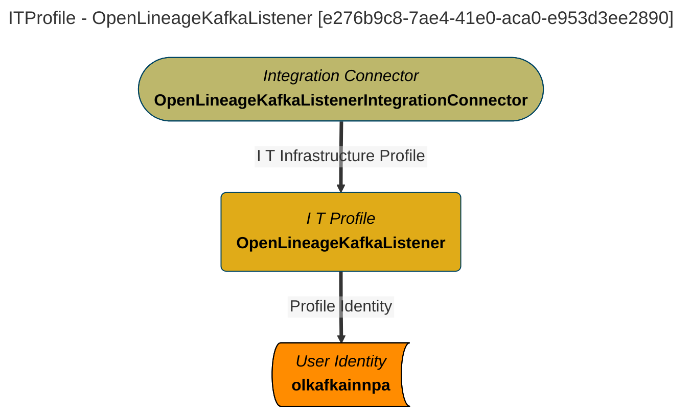

```mermaid
---
title: ITProfile - OpenLineageKafkaListener [e276b9c8-7ae4-41e0-aca0-e953d3ee2890]
---
flowchart TD
%%{init: {"flowchart": {"htmlLabels": false}} }%%

1@{ shape: rounded, label: "*I T Profile*
**OpenLineageKafkaListener**"}
2@{ shape: bow-rect, label: "*User Identity*
**olkafkainnpa**"}
1==>|"Profile Identity"|2
3@{ shape: stadium, label: "*Integration Connector*
**OpenLineageKafkaListenerIntegrationConnector**"}
3==>|"I T Infrastructure Profile"|1
style 1 color:#000000, fill:#e0ab18, stroke:#004563
style 2 color:#000000, fill:#FF8C00, stroke:#000000
style 3 color:#000000, fill:#BDB76B, stroke:#004563
```
> OpenLineageKafkaListener: Receives the open lineage events published to the Apache Kafka topics attached as catalog targets. (Extracted from 6.0-SNAPSHOT)
