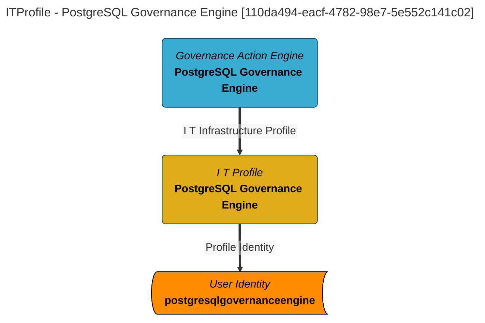

```mermaid
---
title: ITProfile - PostgreSQL Governance Engine [110da494-eacf-4782-98e7-5e552c141c02]
---
flowchart TD
%%{init: {"flowchart": {"htmlLabels": false}} }%%

1@{ shape: rounded, label: "*I T Profile*
**PostgreSQL Governance Engine**"}
2@{ shape: bow-rect, label: "*User Identity*
**postgresqlgovernanceengine**"}
1==>|"Profile Identity"|2
3@{ shape: rounded, label: "*Governance Action Engine*
**PostgreSQL Governance Engine**"}
3==>|"I T Infrastructure Profile"|1
style 1 color:#000000, fill:#e0ab18, stroke:#004563
style 2 color:#000000, fill:#FF8C00, stroke:#000000
style 3 color:#000000, fill:#39add1, stroke:#004563
```
> PostgreSQL Governance Engine: Provides specialist governance services to PostgreSQL servers. (Extracted from 6.0-SNAPSHOT)
