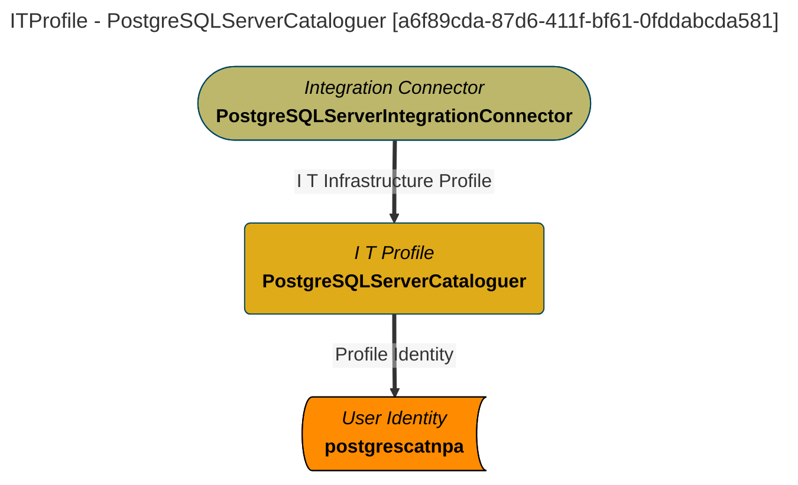

```mermaid
---
title: ITProfile - PostgreSQLServerCataloguer [a6f89cda-87d6-411f-bf61-0fddabcda581]
---
flowchart TD
%%{init: {"flowchart": {"htmlLabels": false}} }%%

1@{ shape: rounded, label: "*I T Profile*
**PostgreSQLServerCataloguer**"}
2@{ shape: bow-rect, label: "*User Identity*
**postgrescatnpa**"}
1==>|"Profile Identity"|2
3@{ shape: stadium, label: "*Integration Connector*
**PostgreSQLServerIntegrationConnector**"}
3==>|"I T Infrastructure Profile"|1
style 1 color:#000000, fill:#e0ab18, stroke:#004563
style 2 color:#000000, fill:#FF8C00, stroke:#000000
style 3 color:#000000, fill:#BDB76B, stroke:#004563
```
> PostgreSQLServerCataloguer: Catalogs the databases found in PostgreSQL Servers attached as catalog targets. (Extracted from 6.0-SNAPSHOT)
