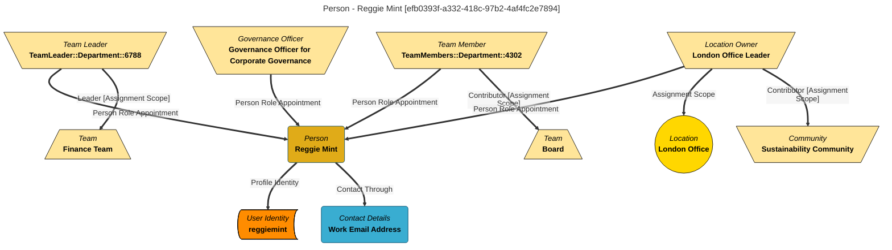

```mermaid
---
title: Person - Reggie Mint [efb0393f-a332-418c-97b2-4af4fc2e7894]
---
flowchart TD
%%{init: {"flowchart": {"htmlLabels": false}} }%%

1@{ shape: rounded, label: "*Person*
**Reggie Mint**"}
2@{ shape: bow-rect, label: "*User Identity*
**reggiemint**"}
1==>|"Profile Identity"|2
3@{ shape: rounded, label: "*Contact Details*
**Work Email Address**"}
1==>|"Contact Through"|3
4@{ shape: trap-t, label: "*Team Leader*
**TeamLeader::Department::6788**"}
4==>|"Person Role Appointment"|1
5@{ shape: trap-b, label: "*Team*
**Finance Team**"}
4==>|"Leader [Assignment Scope]"|5
6@{ shape: trap-t, label: "*Team Member*
**TeamMembers::Department::4302**"}
6==>|"Person Role Appointment"|1
7@{ shape: trap-b, label: "*Team*
**Board**"}
6==>|"Contributor [Assignment Scope]"|7
8@{ shape: trap-t, label: "*Governance Officer*
**Governance Officer for Corporate Governance**"}
8==>|"Person Role Appointment"|1
9@{ shape: trap-t, label: "*Location Owner*
**London Office Leader**"}
9==>|"Person Role Appointment"|1
10@{ shape: circle, label: "*Location*
**London Office**"}
9==>|"Assignment Scope"|10
11@{ shape: trap-t, label: "*Community*
**Sustainability Community**"}
9==>|"Contributor [Assignment Scope]"|11
style 11 color:#000000, fill:#FFE599, stroke:#000000
style 1 color:#000000, fill:#e0ab18, stroke:#004563
style 2 color:#000000, fill:#FF8C00, stroke:#000000
style 3 color:#000000, fill:#39add1, stroke:#004563
style 4 color:#000000, fill:#FFE599, stroke:#000000
style 5 color:#000000, fill:#FFE599, stroke:#000000
style 6 color:#000000, fill:#FFE599, stroke:#000000
style 7 color:#000000, fill:#FFE599, stroke:#000000
style 8 color:#000000, fill:#FFE599, stroke:#000000
style 9 color:#000000, fill:#FFE599, stroke:#000000
style 10 color:#000000, fill:#FFD700, stroke:#000000
```
