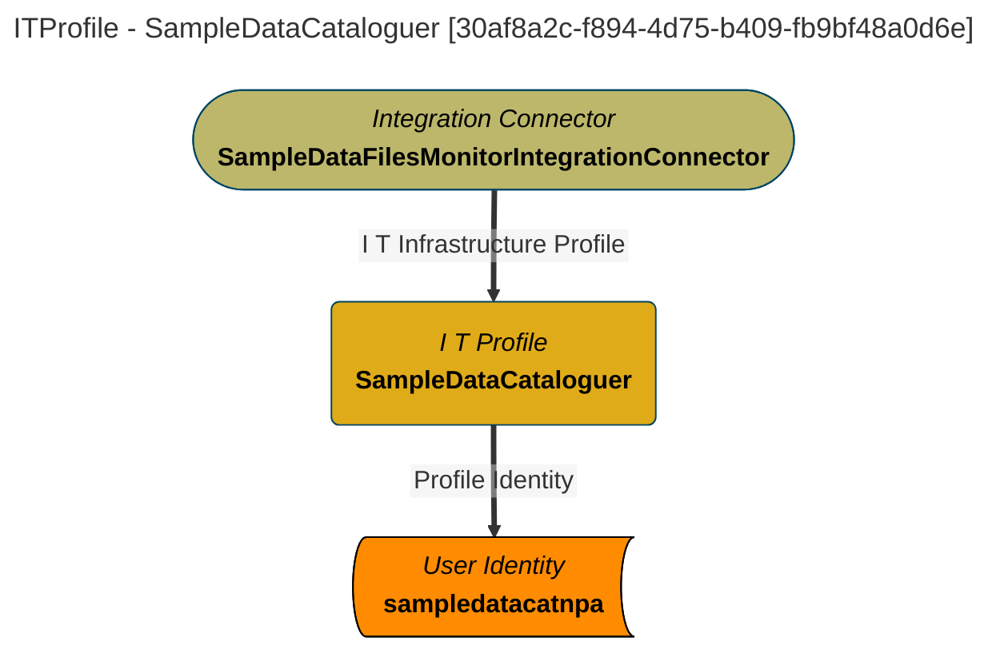

```mermaid
---
title: ITProfile - SampleDataCataloguer [30af8a2c-f894-4d75-b409-fb9bf48a0d6e]
---
flowchart TD
%%{init: {"flowchart": {"htmlLabels": false}} }%%

1@{ shape: rounded, label: "*I T Profile*
**SampleDataCataloguer**"}
2@{ shape: bow-rect, label: "*User Identity*
**sampledatacatnpa**"}
1==>|"Profile Identity"|2
3@{ shape: stadium, label: "*Integration Connector*
**SampleDataFilesMonitorIntegrationConnector**"}
3==>|"I T Infrastructure Profile"|1
style 1 color:#000000, fill:#e0ab18, stroke:#004563
style 2 color:#000000, fill:#FF8C00, stroke:#000000
style 3 color:#000000, fill:#BDB76B, stroke:#004563
```
> SampleDataCataloguer: Catalogs files found under the sample-data directory (folder). (Extracted from 6.0-SNAPSHOT)
