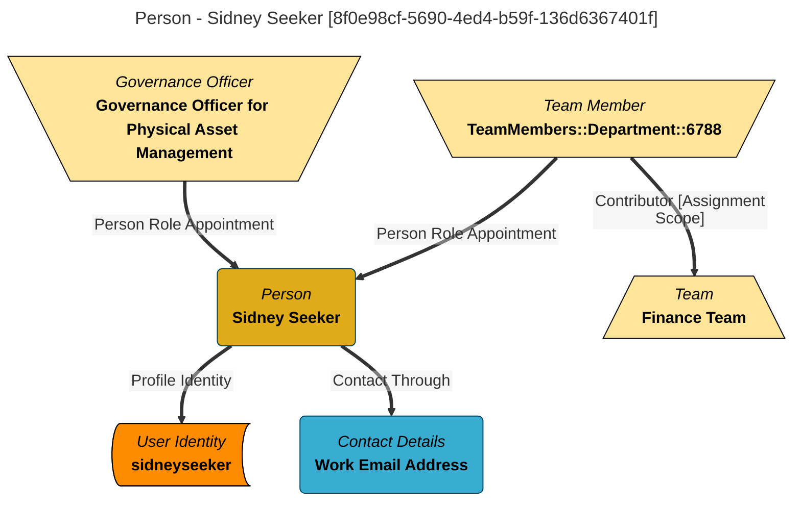

```mermaid
---
title: Person - Sidney Seeker [8f0e98cf-5690-4ed4-b59f-136d6367401f]
---
flowchart TD
%%{init: {"flowchart": {"htmlLabels": false}} }%%

1@{ shape: rounded, label: "*Person*
**Sidney Seeker**"}
2@{ shape: bow-rect, label: "*User Identity*
**sidneyseeker**"}
1==>|"Profile Identity"|2
3@{ shape: rounded, label: "*Contact Details*
**Work Email Address**"}
1==>|"Contact Through"|3
4@{ shape: trap-t, label: "*Governance Officer*
**Governance Officer for Physical Asset Management**"}
4==>|"Person Role Appointment"|1
5@{ shape: trap-t, label: "*Team Member*
**TeamMembers::Department::6788**"}
5==>|"Person Role Appointment"|1
6@{ shape: trap-b, label: "*Team*
**Finance Team**"}
5==>|"Contributor [Assignment Scope]"|6
style 1 color:#000000, fill:#e0ab18, stroke:#004563
style 2 color:#000000, fill:#FF8C00, stroke:#000000
style 3 color:#000000, fill:#39add1, stroke:#004563
style 4 color:#000000, fill:#FFE599, stroke:#000000
style 5 color:#000000, fill:#FFE599, stroke:#000000
style 6 color:#000000, fill:#FFE599, stroke:#000000
```
