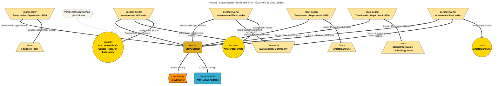

```mermaid
---
title: Person - Steve Starter [91656edd-84a4-472b-bef0-5c17dd1a5dec]
---
flowchart TD
%%{init: {"flowchart": {"htmlLabels": false}} }%%

1@{ shape: rounded, label: "*Person*
**Steve Starter**"}
2@{ shape: bow-rect, label: "*User Identity*
**stevestarter**"}
1==>|"Profile Identity"|2
3@{ shape: rounded, label: "*Contact Details*
**Work Email Address**"}
1==>|"Contact Through"|3
4@{ shape: trap-t, label: "*Team Leader*
**TeamLeader::Department::9999**"}
4==>|"Person Role Appointment"|1
5@{ shape: trap-b, label: "*Team*
**Founders Team**"}
4==>|"Leader [Assignment Scope]"|5
6@{ shape: trap-t, label: "*Location Owner*
**Amsterdam Lab Leader**"}
6==>|"Person Role Appointment"|1
7@{ shape: trap-t, label: "*Community*
**Sustainability Community**"}
6==>|"Contributor [Assignment Scope]"|7
8@{ shape: circle, label: "*Location*
**Van Leeuwenhoek Cancer Research Laboratory**"}
6==>|"Assignment Scope"|8
9@{ shape: trap-t, label: "*Location Owner*
**Amsterdam Office Leader**"}
9==>|"Person Role Appointment"|1
9==>|"Contributor [Assignment Scope]"|7
10@{ shape: circle, label: "*Location*
**Amsterdam Office**"}
9==>|"Assignment Scope"|10
11@{ shape: trap-t, label: "*Team Leader*
**TeamLeader::Department::9998**"}
11==>|"Person Role Appointment"|1
12@{ shape: trap-b, label: "*Team*
**Amsterdam Site**"}
11==>|"Leader [Assignment Scope]"|12
13@{ shape: trap-t, label: "*Team Leader*
**TeamLeader::Department::0004**"}
13==>|"Person Role Appointment"|1
14@{ shape: trap-b, label: "*Team*
**Global Information Technology Team**"}
13==>|"Leader [Assignment Scope]"|14
15@{ shape: trap-t, label: "*Location Owner*
**Amsterdam Site Leader**"}
15==>|"Person Role Appointment"|1
15==>|"Contributor [Assignment Scope]"|7
16@{ shape: circle, label: "*Location*
**Amsterdam Site**"}
15==>|"Assignment Scope"|16
17@{ shape: stadium, label: "*Person Role Appointment*
**... plus 3 Items**"}
17-.->1
style 11 color:#000000, fill:#FFE599, stroke:#000000
style 12 color:#000000, fill:#FFE599, stroke:#000000
style 13 color:#000000, fill:#FFE599, stroke:#000000
style 14 color:#000000, fill:#FFE599, stroke:#000000
style 15 color:#000000, fill:#FFE599, stroke:#000000
style 16 color:#000000, fill:#FFD700, stroke:#000000
style 17 color:#000000, fill:#F9F7ED, stroke:#b7c0c7
style 1 color:#000000, fill:#e0ab18, stroke:#004563
style 2 color:#000000, fill:#FF8C00, stroke:#000000
style 3 color:#000000, fill:#39add1, stroke:#004563
style 4 color:#000000, fill:#FFE599, stroke:#000000
style 5 color:#000000, fill:#FFE599, stroke:#000000
style 6 color:#000000, fill:#FFE599, stroke:#000000
style 7 color:#000000, fill:#FFE599, stroke:#000000
style 8 color:#000000, fill:#FFD700, stroke:#000000
style 9 color:#000000, fill:#FFE599, stroke:#000000
style 10 color:#000000, fill:#FFD700, stroke:#000000
```
