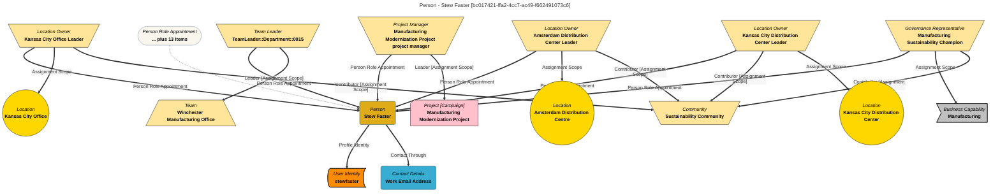

```mermaid
---
title: Person - Stew Faster [bc017421-ffa2-4cc7-ac49-f662491073c6]
---
flowchart TD
%%{init: {"flowchart": {"htmlLabels": false}} }%%

1@{ shape: rounded, label: "*Person*
**Stew Faster**"}
2@{ shape: bow-rect, label: "*User Identity*
**stewfaster**"}
1==>|"Profile Identity"|2
3@{ shape: rounded, label: "*Contact Details*
**Work Email Address**"}
1==>|"Contact Through"|3
4@{ shape: trap-t, label: "*Location Owner*
**Kansas City Office Leader**"}
4==>|"Person Role Appointment"|1
5@{ shape: circle, label: "*Location*
**Kansas City Office**"}
4==>|"Assignment Scope"|5
6@{ shape: trap-t, label: "*Community*
**Sustainability Community**"}
4==>|"Contributor [Assignment Scope]"|6
7@{ shape: trap-t, label: "*Team Leader*
**TeamLeader::Department::0015**"}
7==>|"Person Role Appointment"|1
8@{ shape: trap-b, label: "*Team*
**Winchester Manufacturing Office**"}
7==>|"Leader [Assignment Scope]"|8
9@{ shape: trap-t, label: "*Project Manager*
**Manufacturing Modernization Project project manager**"}
9==>|"Person Role Appointment"|1
10@{ shape: notch-rect, label: "*Project [Campaign]*
**Manufacturing Modernization Project**"}
9==>|"Leader [Assignment Scope]"|10
11@{ shape: trap-t, label: "*Location Owner*
**Amsterdam Distribution Center Leader**"}
11==>|"Person Role Appointment"|1
12@{ shape: circle, label: "*Location*
**Amsterdam Distribution Centre**"}
11==>|"Assignment Scope"|12
11==>|"Contributor [Assignment Scope]"|6
13@{ shape: trap-t, label: "*Location Owner*
**Kansas City Distribution Center Leader**"}
13==>|"Person Role Appointment"|1
13==>|"Contributor [Assignment Scope]"|6
14@{ shape: circle, label: "*Location*
**Kansas City Distribution Center**"}
13==>|"Assignment Scope"|14
15@{ shape: trap-t, label: "*Governance Representative*
**Manufacturing Sustainability Champion**"}
15==>|"Person Role Appointment"|1
16@{ shape: odd, label: "*Business Capability*
**Manufacturing**"}
15==>|"Assignment Scope"|16
15==>|"Contributor [Assignment Scope]"|6
17@{ shape: stadium, label: "*Person Role Appointment*
**... plus 13 Items**"}
17-.->1
style 11 color:#000000, fill:#FFE599, stroke:#000000
style 12 color:#000000, fill:#FFD700, stroke:#000000
style 13 color:#000000, fill:#FFE599, stroke:#000000
style 14 color:#000000, fill:#FFD700, stroke:#000000
style 15 color:#000000, fill:#FFE599, stroke:#000000
style 16 color:#000000, fill:#C0C0C0, stroke:#000000
style 17 color:#000000, fill:#F9F7ED, stroke:#b7c0c7
style 1 color:#000000, fill:#e0ab18, stroke:#004563
style 2 color:#000000, fill:#FF8C00, stroke:#000000
style 3 color:#000000, fill:#39add1, stroke:#004563
style 4 color:#000000, fill:#FFE599, stroke:#000000
style 5 color:#000000, fill:#FFD700, stroke:#000000
style 6 color:#000000, fill:#FFE599, stroke:#000000
style 7 color:#000000, fill:#FFE599, stroke:#000000
style 8 color:#000000, fill:#FFE599, stroke:#000000
style 9 color:#000000, fill:#FFE599, stroke:#000000
style 10 color:#000000, fill:#FFC0CB, stroke:#000000
```
