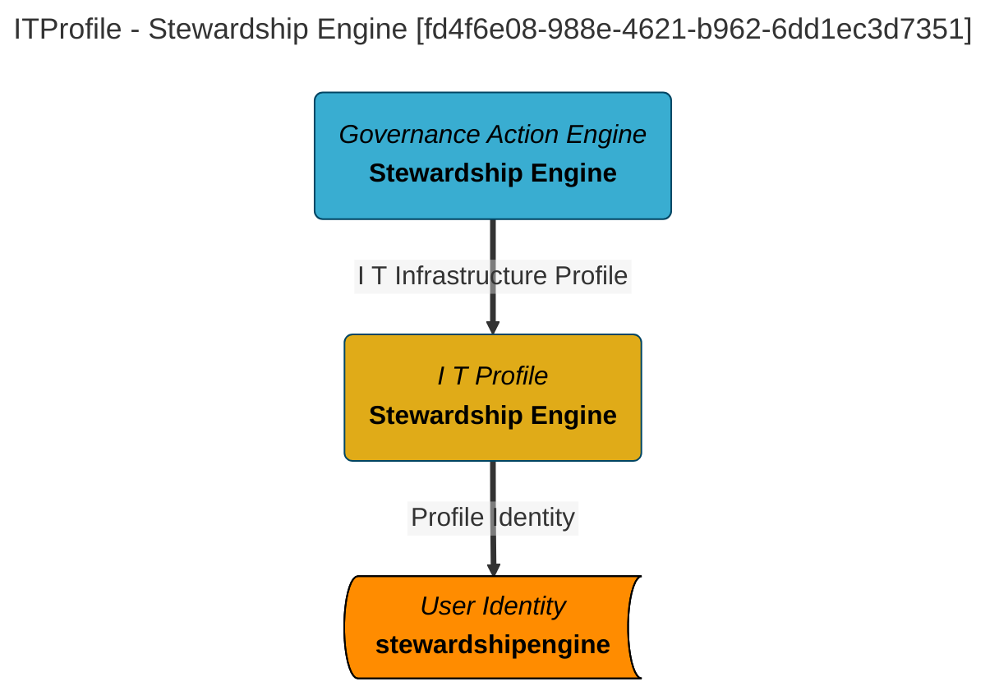

```mermaid
---
title: ITProfile - Stewardship Engine [fd4f6e08-988e-4621-b962-6dd1ec3d7351]
---
flowchart TD
%%{init: {"flowchart": {"htmlLabels": false}} }%%

1@{ shape: rounded, label: "*I T Profile*
**Stewardship Engine**"}
2@{ shape: bow-rect, label: "*User Identity*
**stewardshipengine**"}
1==>|"Profile Identity"|2
3@{ shape: rounded, label: "*Governance Action Engine*
**Stewardship Engine**"}
3==>|"I T Infrastructure Profile"|1
style 1 color:#000000, fill:#e0ab18, stroke:#004563
style 2 color:#000000, fill:#FF8C00, stroke:#000000
style 3 color:#000000, fill:#39add1, stroke:#004563
```
> Stewardship Engine: Liaises with stewards to make corrections to open metadata. (Extracted from 6.0-SNAPSHOT)
