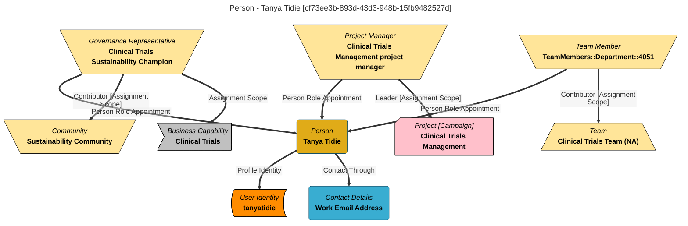

```mermaid
---
title: Person - Tanya Tidie [cf73ee3b-893d-43d3-948b-15fb9482527d]
---
flowchart TD
%%{init: {"flowchart": {"htmlLabels": false}} }%%

1@{ shape: rounded, label: "*Person*
**Tanya Tidie**"}
2@{ shape: bow-rect, label: "*User Identity*
**tanyatidie**"}
1==>|"Profile Identity"|2
3@{ shape: rounded, label: "*Contact Details*
**Work Email Address**"}
1==>|"Contact Through"|3
4@{ shape: trap-t, label: "*Governance Representative*
**Clinical Trials Sustainability Champion**"}
4==>|"Person Role Appointment"|1
5@{ shape: trap-t, label: "*Community*
**Sustainability Community**"}
4==>|"Contributor [Assignment Scope]"|5
6@{ shape: odd, label: "*Business Capability*
**Clinical Trials**"}
4==>|"Assignment Scope"|6
7@{ shape: trap-t, label: "*Project Manager*
**Clinical Trials Management project manager**"}
7==>|"Person Role Appointment"|1
8@{ shape: notch-rect, label: "*Project [Campaign]*
**Clinical Trials Management**"}
7==>|"Leader [Assignment Scope]"|8
9@{ shape: trap-t, label: "*Team Member*
**TeamMembers::Department::4051**"}
9==>|"Person Role Appointment"|1
10@{ shape: trap-b, label: "*Team*
**Clinical Trials Team (NA)**"}
9==>|"Contributor [Assignment Scope]"|10
style 1 color:#000000, fill:#e0ab18, stroke:#004563
style 2 color:#000000, fill:#FF8C00, stroke:#000000
style 3 color:#000000, fill:#39add1, stroke:#004563
style 4 color:#000000, fill:#FFE599, stroke:#000000
style 5 color:#000000, fill:#FFE599, stroke:#000000
style 6 color:#000000, fill:#C0C0C0, stroke:#000000
style 7 color:#000000, fill:#FFE599, stroke:#000000
style 8 color:#000000, fill:#FFC0CB, stroke:#000000
style 9 color:#000000, fill:#FFE599, stroke:#000000
style 10 color:#000000, fill:#FFE599, stroke:#000000
```
