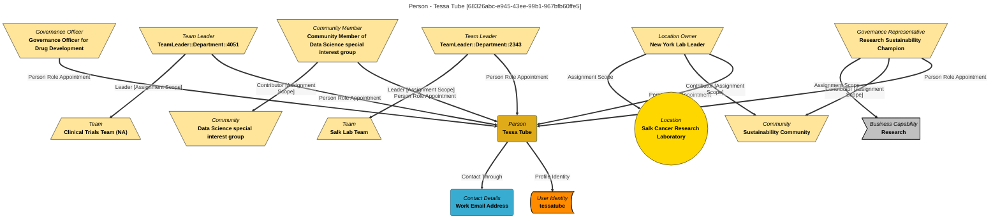

```mermaid
---
title: Person - Tessa Tube [68326abc-e945-43ee-99b1-967bfb60ffe5]
---
flowchart TD
%%{init: {"flowchart": {"htmlLabels": false}} }%%

1@{ shape: rounded, label: "*Person*
**Tessa Tube**"}
2@{ shape: bow-rect, label: "*User Identity*
**tessatube**"}
1==>|"Profile Identity"|2
3@{ shape: rounded, label: "*Contact Details*
**Work Email Address**"}
1==>|"Contact Through"|3
4@{ shape: trap-t, label: "*Governance Officer*
**Governance Officer for Drug Development**"}
4==>|"Person Role Appointment"|1
5@{ shape: trap-t, label: "*Governance Representative*
**Research Sustainability Champion**"}
5==>|"Person Role Appointment"|1
6@{ shape: trap-t, label: "*Community*
**Sustainability Community**"}
5==>|"Contributor [Assignment Scope]"|6
7@{ shape: odd, label: "*Business Capability*
**Research**"}
5==>|"Assignment Scope"|7
8@{ shape: trap-t, label: "*Location Owner*
**New York Lab Leader**"}
8==>|"Person Role Appointment"|1
8==>|"Contributor [Assignment Scope]"|6
9@{ shape: circle, label: "*Location*
**Salk Cancer Research Laboratory**"}
8==>|"Assignment Scope"|9
10@{ shape: trap-t, label: "*Team Leader*
**TeamLeader::Department::2343**"}
10==>|"Person Role Appointment"|1
11@{ shape: trap-b, label: "*Team*
**Salk Lab Team**"}
10==>|"Leader [Assignment Scope]"|11
12@{ shape: trap-t, label: "*Community Member*
**Community Member of Data Science special interest group**"}
12==>|"Person Role Appointment"|1
13@{ shape: trap-t, label: "*Community*
**Data Science special interest group**"}
12==>|"Contributor [Assignment Scope]"|13
14@{ shape: trap-t, label: "*Team Leader*
**TeamLeader::Department::4051**"}
14==>|"Person Role Appointment"|1
15@{ shape: trap-b, label: "*Team*
**Clinical Trials Team (NA)**"}
14==>|"Leader [Assignment Scope]"|15
style 11 color:#000000, fill:#FFE599, stroke:#000000
style 12 color:#000000, fill:#FFE599, stroke:#000000
style 13 color:#000000, fill:#FFE599, stroke:#000000
style 14 color:#000000, fill:#FFE599, stroke:#000000
style 15 color:#000000, fill:#FFE599, stroke:#000000
style 1 color:#000000, fill:#e0ab18, stroke:#004563
style 2 color:#000000, fill:#FF8C00, stroke:#000000
style 3 color:#000000, fill:#39add1, stroke:#004563
style 4 color:#000000, fill:#FFE599, stroke:#000000
style 5 color:#000000, fill:#FFE599, stroke:#000000
style 6 color:#000000, fill:#FFE599, stroke:#000000
style 7 color:#000000, fill:#C0C0C0, stroke:#000000
style 8 color:#000000, fill:#FFE599, stroke:#000000
style 9 color:#000000, fill:#FFD700, stroke:#000000
style 10 color:#000000, fill:#FFE599, stroke:#000000
```
